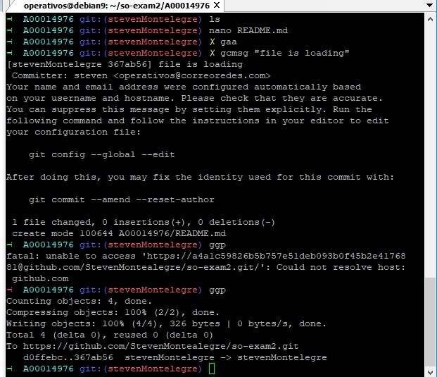
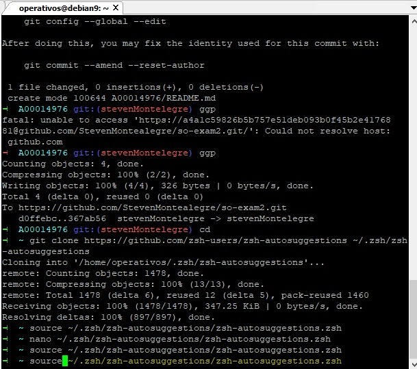
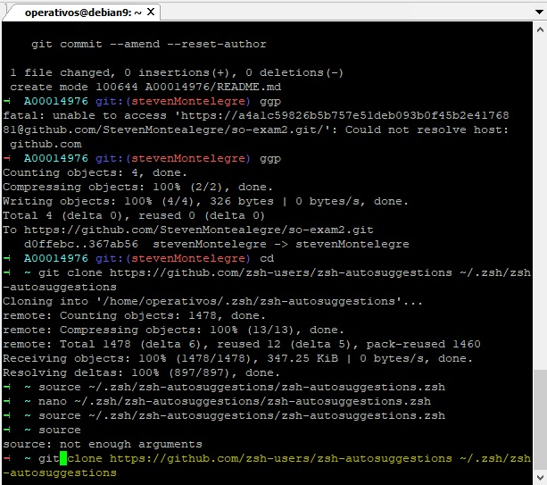
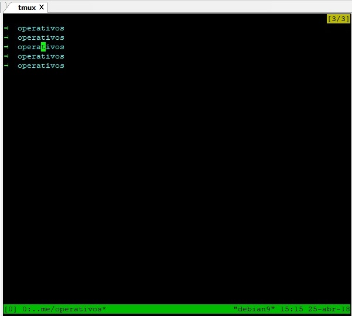
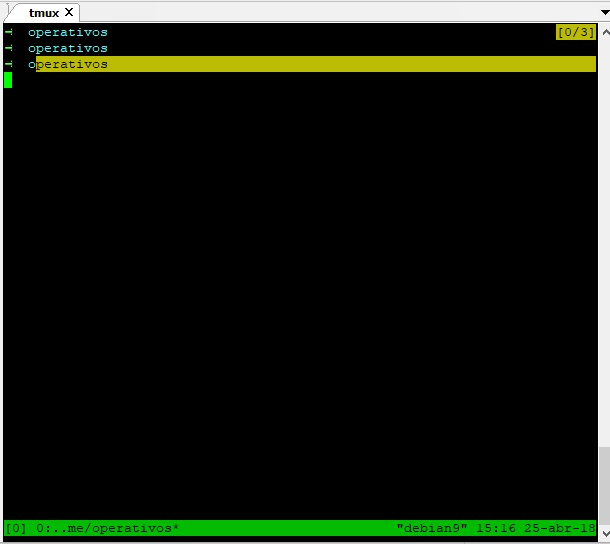
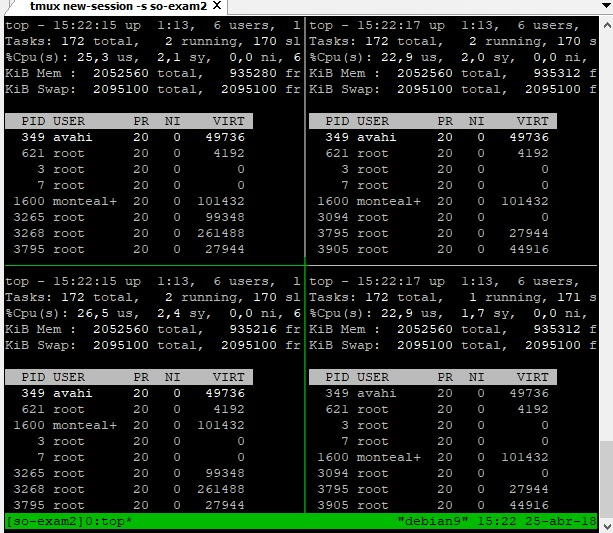
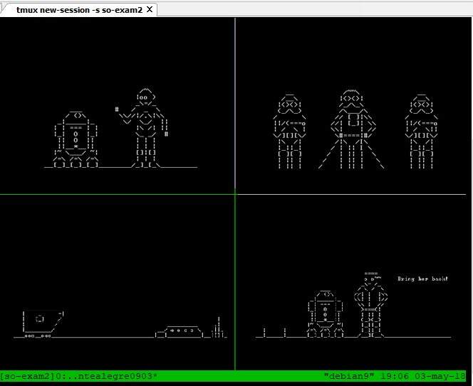
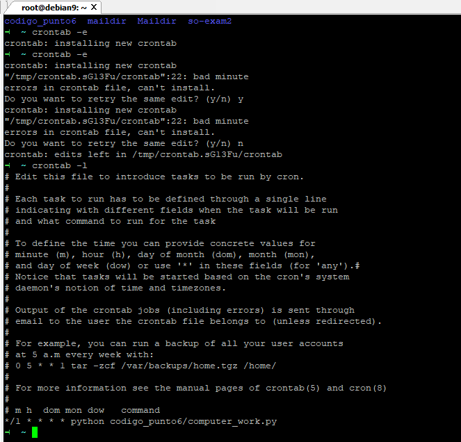
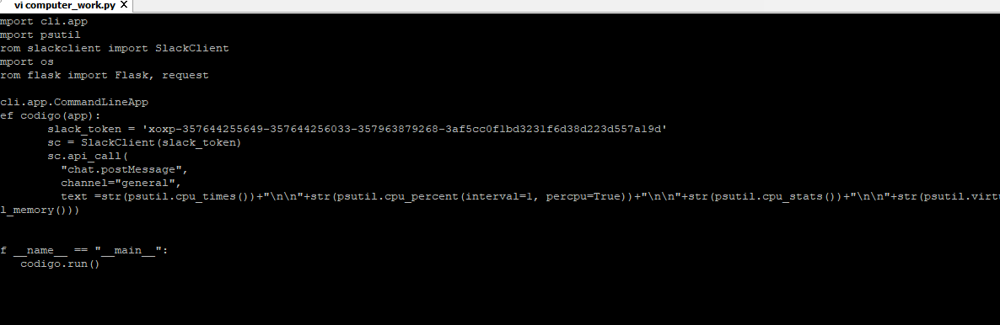
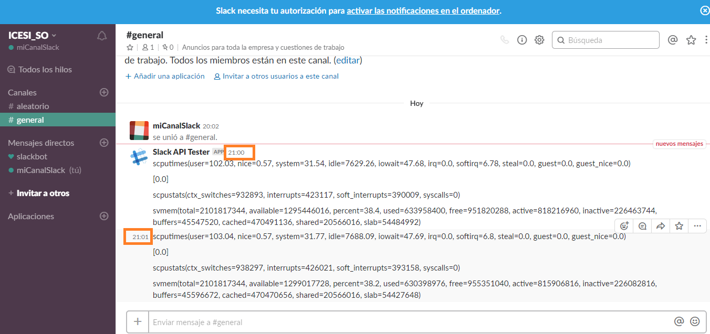

## Universidad ICESI  
## Curso: Sistemas Operativos    
## Estudiante: Steven Montealegre Gutiérrez
## Tema: Segundo parcial SO
## Correo: james.montealegre@correo.icesi.edu.co

## 3.  ----------------------------------------------------------------------  
Para la instalación de git se usa: # apt-get install git  
Para la instalación de zsh se usa: # apt-get install zsh  
Para la instalación de Oh-my-zsh se ejecuta: sh -c "$(wget https://raw.githubusercontent.com/robbyrussell/oh-my-zsh/master/tools/install.sh -O -)"  

  

## 4.  ----------------------------------------------------------------------  
Ejecutamos el comando git clone https://github.com/zsh-users/zsh-autosuggestions ~/.zsh/zsh-autosuggestions  
seguido: source ~/.zsh/zsh-autosuggestions/zsh-autosuggestions.zsh.  Para cambiar el color de resaltado nos vamos a la siguiente línea y cambiamos el valor 8 por yellow:

  
  

## 5.  ----------------------------------------------------------------------  
Instalación tmux: ~ apt-get install tmux -y:
Ejecución de tmux: ~ tmux  

  
   

## 6.  ----------------------------------------------------------------------  

  

  

## 7.  ----------------------------------------------------------------------  

  

