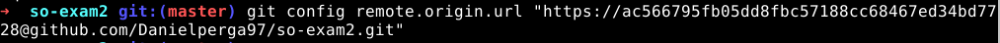
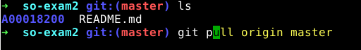
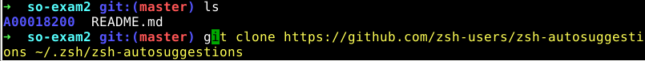
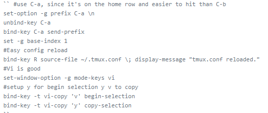
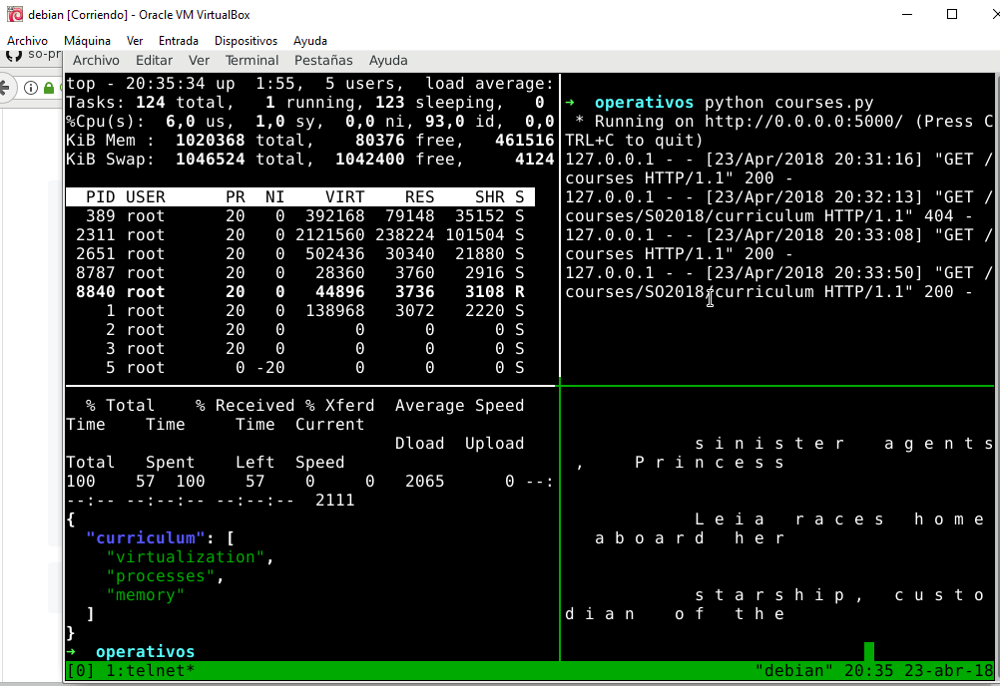
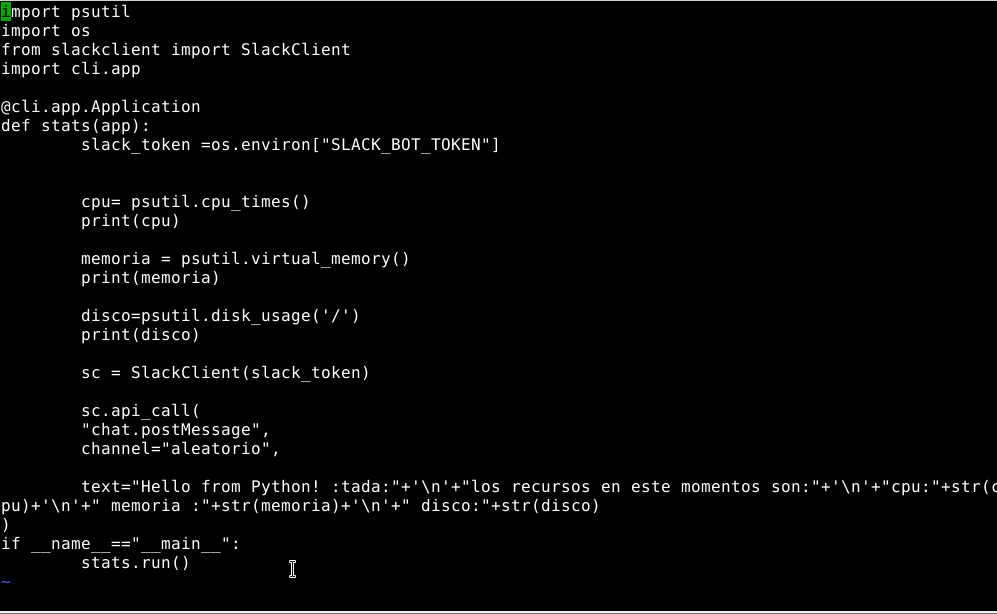
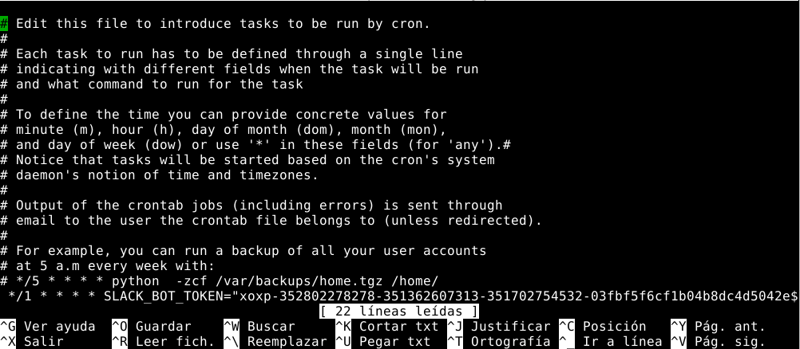
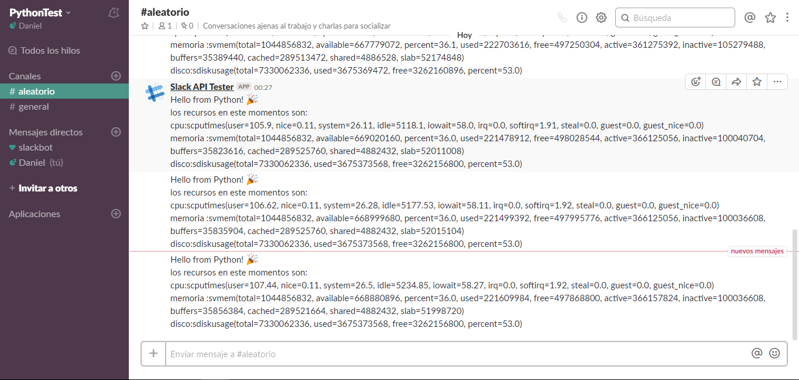

### EXAMEN 2  
**Nombre:** Daniel Perez Garcia
**Código:** A00018200  
**Materia:** Sistemas operativos  
**Correo personal:** danielperga97@outlook.com  
**URL repositorio:** https://github.com/Danielperga97/so-exam2.git

### 3 Instalación y configuración zsh,oh  my zsh y git  

1. Para instalar git Usamos el comando: ``# apt-get install git`` y para instalar zsh usamos ``# apt-get install zsh``  

2. Una vez tengamos instalado zsh procederemos a instalar Oh-my-zsh mediante el comando: ``sh -c "$(wget https://raw.githubusercontent.com/robbyrussell/oh-my-zsh/master/tools/install.sh -O -)"``  

3. Para que oh my zsh se alique a todos los usuarios ejecutamos: ``export ZSH="$HOME/.dotfiles/oh-my-zsh"; sh -c "$(curl -fsSL https://raw.githubusercontent.com/robbyrussell/oh-my-zsh/master/tools/install.sh)"``  

4. Finalmente configuramos nuestro token de github mediante el siguiente comando
  

Captura de Pantalla comandos Oh-my-zsh: 
  

### 4 Instalación Plugin zsh-autosuggestions

1. descargamos el plugin desde github con el comando ``git clone https://github.com/zsh-users/zsh-autosuggestions ~/.zsh/zsh-autosuggestions``

2. lo anadimos a zshrc con el comando ``source ~/.zsh/zsh-autosuggestions/zsh-autosuggestions.zsh``

3. Ahora reiniciamos la terminal y veremos el plugin en accion.

4. Para editar los valores de este plugin como el color de la sugerencia usamos el comando  ``~/.zsh/zsh-autosuggestions`` y posteriormente  ``vi zsh-autosuggestions.zsh``  

5. Para cambiar el color a amarillo reemplazamos el valor del atributo AUTOSUGGESTION_HIGHLIGHT_COLOR de 8 a 11.

6. En estas captura podemos observar el resultado:

  

### 5 Instalación y configuracion TMUX

1. Instalamos tmux con el comando   `` sudo yum install tmux -y`` 

2.  Para cambiar la configuracion de teclas y activar el modo vi ejecutamos el comando ``$ vi ~/.tmux.conf`` y anadimos la siguiente configuracion al archivo :

Asi se veria al usuar el modo vi 

### 6 Pantalla dividida 

Podemos Observar la pantalla dividida de tmux con los 4 cuadrantes solicitados:

### Punto 7

1. Instalamos lo modulos necesarios mediante los comandos:

- ``pip install pyCLI`` Para instalar el modulo pyCLI que nos permitira ejecutar nuetra aplicacion como una de linea de comandos
- ``pip install psutil`` para instalar el modulo psutil que nos permitira obtener los valores de nuestro sistema
- `` pip install slackclient`` para instalar el cliente de slack

2. Creamos nuestro espacio en slack y solicitamos el token para el mismo.

3. nuestro codigo quedara de la siguiente forma:

4. Lo siguiente es configurar crontab para que lo ejecute en los intervalos de tiempo  que necesitamos. para probar lo ejecutaremos primero cada minuto. Mediante el comando `` crontab -e`` Abrimos el archivo de configuracion de crontab e ingresamos los siguientes parametros `` */1 * * * * `` seguido de la instruccion que ejecuta nuestro archivo:

Al revisar el canal de slack podemos ver que funciona:

Finalmente lo configuramos para que se ejecute todos los dias cambiando los parametros por: `` 00 8 * * * `` seguidos de la instruccion 

