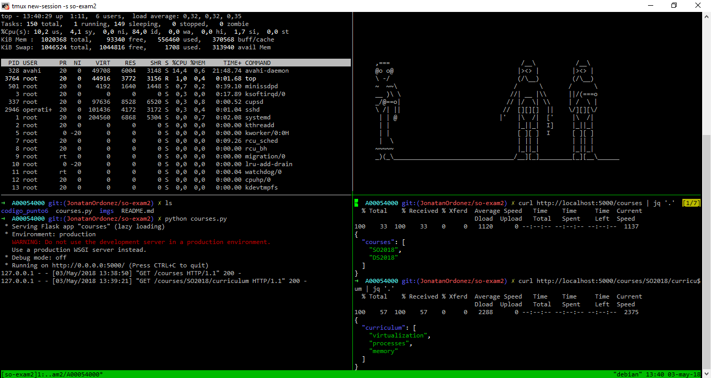

### Examen 2
**Universidad ICESI**  
**Curso:** Sistemas Operativos  
**Docente:** Daniel Barragán C.  
**Tema:** Comandos de Linux, Scripts, Herramientas

**Código:** A00054000   
**Nombre:** Jonatan Ordoñez   
**Repositorio GitHub:** https://github.com/JonatanOrdonez/so-exam2/tree/JonatanOrdonez/so-exam2

### PUNTO 3: INSTALACIÓN Y CONFIGURACIÓN DE ZSH Y GIT

Después de instalar oh my zsh, git y tmux, podemos ver en la siguiente imágen las versiones de los programas instalados:

### PUNTO 3.1: USO DE LOS COMANDOS GAA, GCMSG Y GPP PARA EL ENVÍO DE UN COMMIT AL FORK DEL REPOSITORIO so-exam2

En las imágenes mostradas a continuación se ve el uso de los commandos gaa, gcmsg y gpp para el envio de un primer commit al repositorio https://github.com/JonatanOrdonez/so-exam2/tree/JonatanOrdonez/so-exam2:

### PUNTO 4: INSTALACIÓN Y CONFIGURACIÓN DEL PLUGIN ZSH-AUTOSUGGESTIONS

A continuación, se presentan dos ejemplos de autocompletado utilizando dos commandos en linux y el plugin zsh-autosuggestions:

### PUNTO 5: INSTALACIÓN Y CONFIGURACIÓN TMUX

Utilizando asccinema para grabar la terminal de fedora, se crea el siguiente video en el cual se ilustra el funcionamiento del modo vi para la navegación a través del buffer.

[Link video en asciinema](https://asciinema.org/a/179430)

### CREACIÓN DE SESIÓN EN TMUX DE NOMBRE so-exam2

En la siguiente imágen se puede observar una sesión en tmux dividida en cuatro secciones. En la priemra sección se observa el resultado del comando top; en la segunda se ve la saluda del comando telnet towel.blinkenlights.nl, sin embargo no logra conectarse al host para obtener el resultado; en la tercera se visualiza la salida de la ejecución del script courses.py; finalmente, en el último cuadrante se ve la salida del comando curl http://localhost:5000/courses | jq '.':

