# PARCIAL 2

**Universidad Icesi**

**Nombre:** Laura Tabares

**Codigo:** A00054120

**URL repositorio:** https://github.com/Lauraitp/so-exam2

___________________________

Paso 0:
Instalar las siguientes librías:

```
apt-get install pip
```

```
apt-get install gcc python-dev python-pip
```

```
apt-get install curl
```

```
pip install flask
```

```
pip install psutil
```

```
pip install pyCLI
```

```
apt-get install jq -y
```

y por último 

```
pip install slackclient
```

El resto de las librerías se irán instalando a medida que avanza el tutuorial.


1. Instalación del git y el zsh
 * Para la instalación tanto de git como zsh con los siguientes comandos:

```
apt-get install zsh -y
```

```
apt-get install git -y
```

Luego de la instalación de ambos se descarga oh my zsh

```
wget https://github.com/robbyrussell/oh-my-zsh/raw/master/tools/install.sh -O - | zsh
```
 * Configuración del token.
Para configurarlo, primero se debe clonar el repositorio y luego ejecutar el siguiente comando:

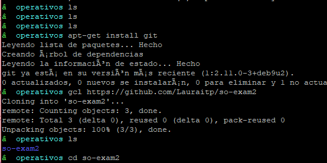

```
 git config remote.origin.url "https://topSecretToken@github.com/Lauraitp/so-exam2.git"
```


 * Pantallas con el uso de comandos abreviados de git.

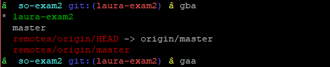

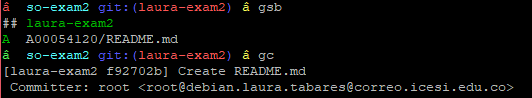

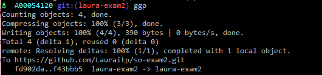

_____________________________

### 4. Instalación y configuración de:

 * zsh-autosuggestion:

Para la instalación de este plugin se debe seguir con los siguientes pasos:

Clonar el repositorio
```
git clone https://github.com/zsh-users/zsh-autosuggestions $ZSH_CUSTOM/plugins/zsh-autosuggestions
```

Adicionar el plugin

```
$ vi ~/.zshrc
plugins=(git vi-mode zsh-autosuggestions)
$ source ~/.zshrc
```
Modificar el valor para las sugerencias, en mi caso será amarillo:

```
$ vi $ZSH_CUSTOM/dbarragan.zsh
export ZSH_AUTOSUGGEST_HIGHLIGHT_STYLE="fg=yellow"
$ source ~/.zshrc
```

Pantallas con ejemplos:

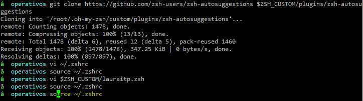

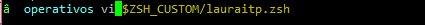

________________________

### 3. Instalación y configuración del tmux

 * Instalar tmux:

```
apt-get install tmux -y
```

 * Configurar tmux con el prefijo A

```
$ vi ~/.tmux.conf
```

```
# use C-a, since it's on the home row and easier to hit than C-b
set-option -g prefix C-a
unbind-key C-a
bind-key C-a send-prefix
set -g base-index 1

# Easy config reload
bind-key R source-file ~/.tmux.conf \; display-message "tmux.conf reloaded."

# vi is good
setw -g mode-keys vi

# Setup 'v' to begin selection as in Vim
bind-key -Tcopy-mode-vi v send -X begin-selection
```

Prefijo A para realizar todo, mi llave:

Ejmeplo para dividir las pantallas

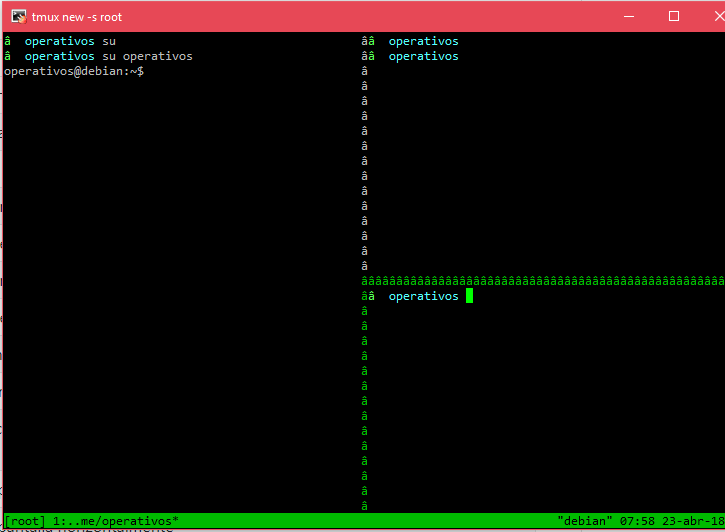

Prefijo R para reload:

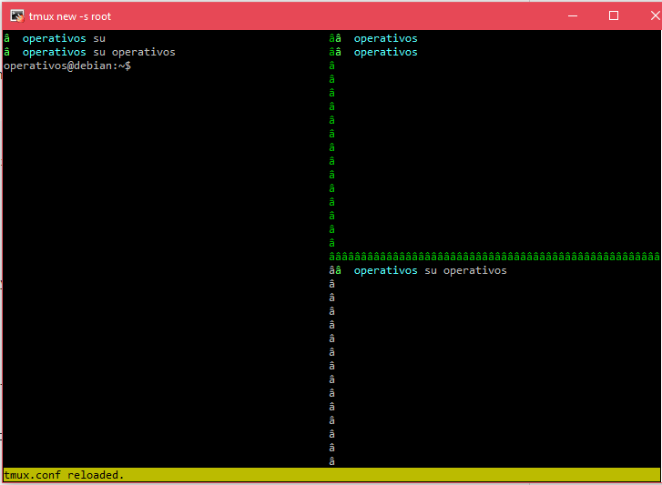

 * Activar vi mode

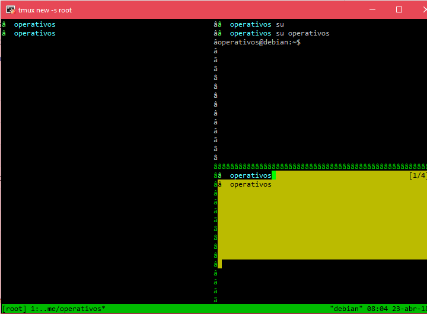

 * En asciinema:

	* primero se debe instalar ASCIINEMA
 ```
apt-get install asciinema -y
```

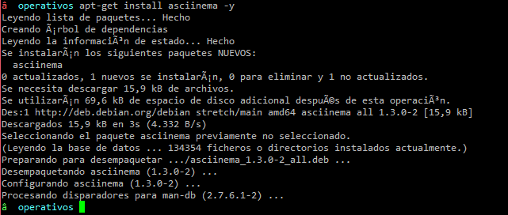

**URL:** https://asciinema.org/a/4hdyW1tMOYlQHtKdvsgbs2bZu

Pantallas de ejemplos

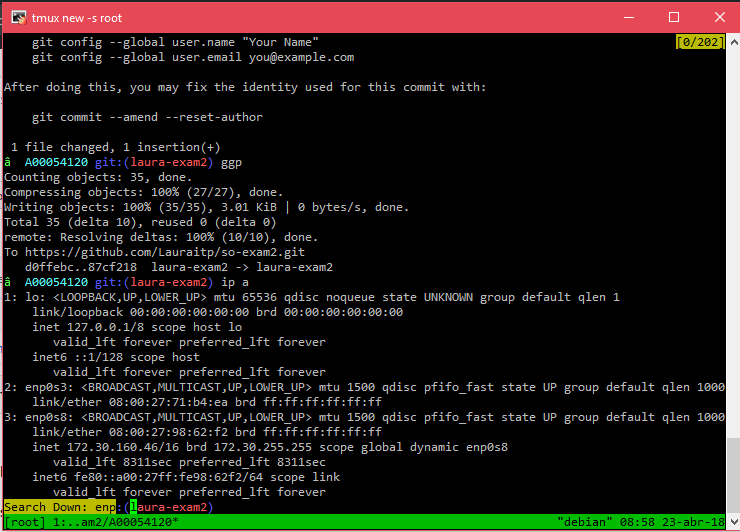

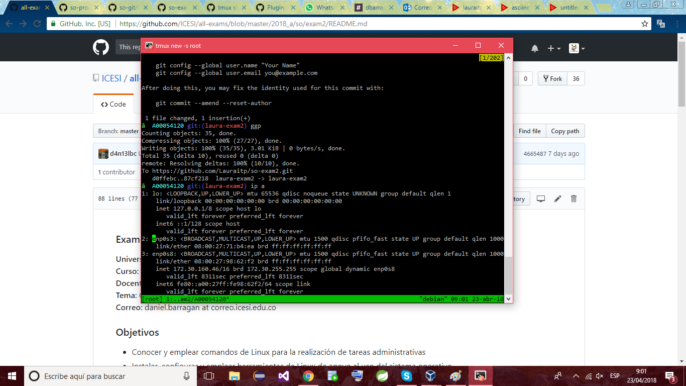

### 6. Cree una sesion de nombre so-exam2. Divide la pantalla en cuatro cuadrantes y en cada cuadrante muestre lo siguiente (20%):

Para crear una sesión se debe digitar el siguiente comando `
```
 tmux new-session -s so-exam2
```

Para dividir las pantallas en vertical: CTRL+a and %
Para dividir las pantallas en horizontal: CTRL+a and "


Salida del comando top: Solo escribir top en la consola.

Salida de la ejecución del script de python courses.py: Lo que se debe escribir es:

```
# courses.py
from flask import Flask
import json
app = Flask(__name__)

@app.route("/courses")
def courses():
    courses = {"courses": ["SO2018", "DS2018"]}
    return json.dumps(courses), 200

@app.route("/courses/SO2018/curriculum")
def curriculum():
    curriculum = {"curriculum": ["virtualization", "processes", "memory"]}
    return json.dumps(curriculum), 200

if __name__ == "__main__":
    app.run('0.0.0.0')
```

para luego ejecutarlo con:
```
python courses.py
```

Peticiones por medio de curl a cada endpoint. Salida formateada con jq: Realizar peticiones con el siguiente comando
```
curl "http://0.0.0.0:5000/courses/SO2018/curriculum | jq '.'
```

Salida de la ejecución de: 
```
telnet towel.blinkenlights.nl
```
Incluya una captura de pantalla de los cuatro cuadrantes:

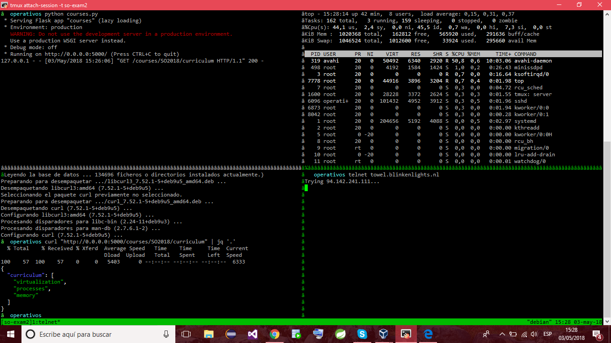

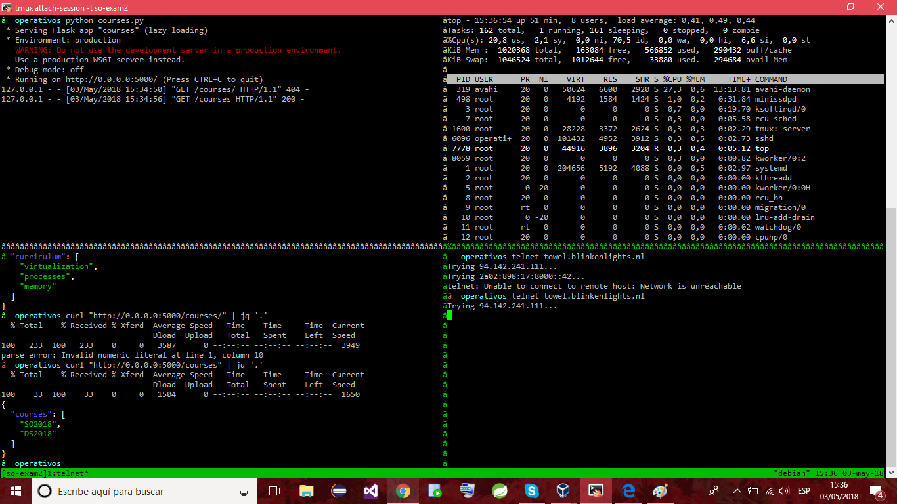

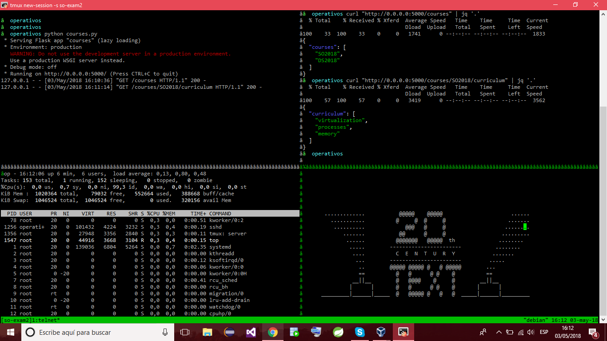

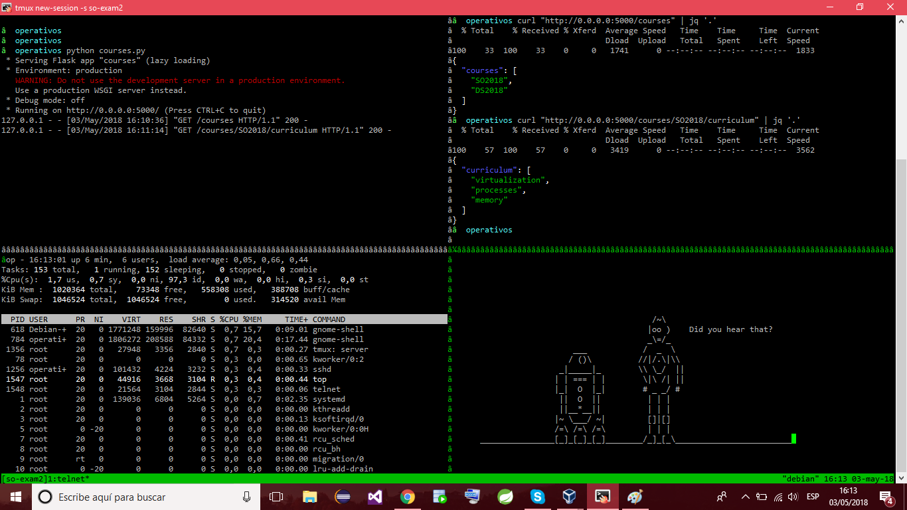

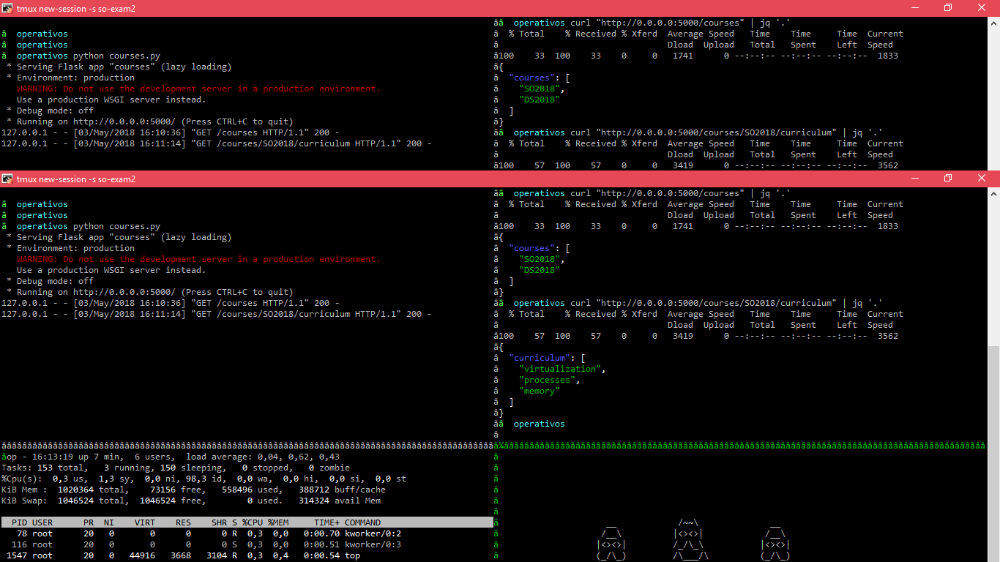

### 7. API EN SLACK 

a. Crear un workspace y luego un canal, el workspace se crea para solicitar el token porque se necesita en el código y también el nombre del canal en slack.

Crear un archivo con extension .py en el repositorio, donde se puede ver el código en el siguiente link:
**URL:** https://github.com/Lauraitp/so-exam2/blob/laura-exam2/A00054120/codigo_punto6/codigo_punto6.py 

No sobra aclarar que los paquetes que se instalaron en el paso 0 del tutorial serán de mucha utilidad en este punto.


Para programar las tareas se ejecuta el comando 
```
crontab -e
```

Escribir la tarea: 
En mi caso ca 5 minutos.

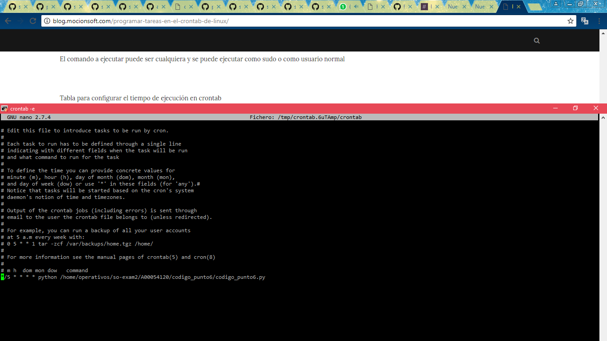

Luego, se debe correr el archivo .py con el siguiente comando:
```
python codigo_punto6.py
```

Respuesta:

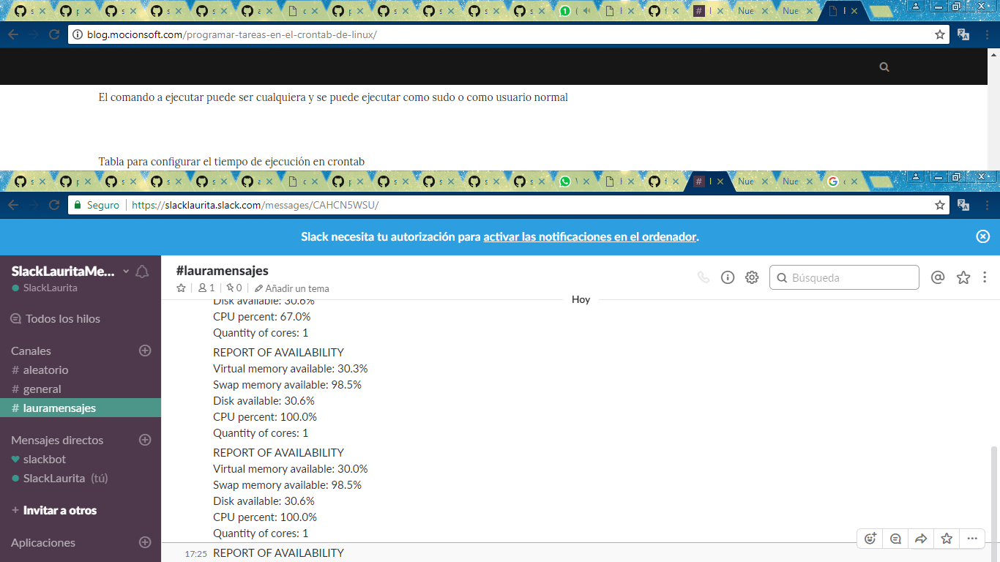

Para otros tiempos aquí otros ejemplos:

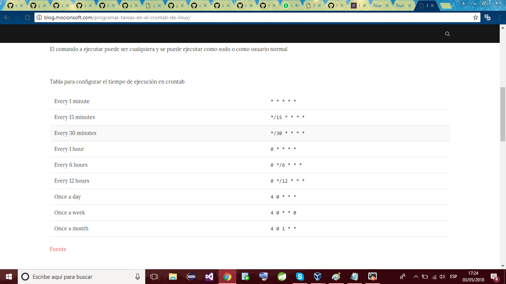
