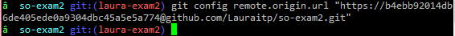

#PARCIAL 2

**Universidad Icesi**

**Nombre:** Laura Tabares

**Codigo:** A00054120

**URL repositorio:** https://github.com/Lauraitp/so-exam2

___________________________

1. Instalación del git y el zsh
 * Para la instalación tanto de git como zsh con los siguientes comandos:

```
apt-get install zsh -y
```

```
apt-get install git -y
```

Luego de la instalación de ambos se descarga oh my zsh

```
wget https://github.com/robbyrussell/oh-my-zsh/raw/master/tools/install.sh -O - | zsh
```
 * Configuración del token.
Para configurarlo, primero se debe clonar el repositorio y luego ejecutar el siguiente comando:


```
 git config remote.origin.url "https://topSecretToken@github.com/Lauraitp/so-exam2.git"
```



 * Pantallas con el uso de comandos abreviados de git.


_____________________________

4. Instalación y configuración de:

 * zsh-autosuggestion:

Para la instalación de este plugin se debe seguir con los siguientes pasos:

Clonar el repositorio
```
git clone https://github.com/zsh-users/zsh-autosuggestions $ZSH_CUSTOM/plugins/zsh-autosuggestions
```

Adicionar el plugin

```
$ vi ~/.zshrc
plugins=(git vi-mode zsh-autosuggestions)
$ source ~/.zshrc
```
Modificar el valor para las sugerencias, en mi caso sá amarillo:

```
$ vi $ZSH_CUSTOM/dbarragan.zsh
export ZSH_AUTOSUGGEST_HIGHLIGHT_STYLE="fg=yellow"
$ source ~/.zshrc
```


________________________

3. Instalación y configuración del tmux


