### EXAMEN 2  
**Nombre:** Miguel Andrés Isaza Barona  
**Código:** A00054628  
**Materia:** Sistemas operacionales  
**Correo personal:** miguel11andres@hotmail.com  
**URL repositorio:** https://github.com/DonMiguelin/so-exam2.git

### 3 Instalación y configuración de zsh y git  

-Para la instalación de git se usa el siguiente comando: ``# apt-get install git``  
-Para la instalación de zsh se usa el siguiente comando: ``# apt-get install zsh``  
-Para la instalación de Oh-my-zsh se ejecuta el siguiente comando: ``sh -c "$(wget https://raw.githubusercontent.com/robbyrussell/oh-my-zsh/master/tools/install.sh -O -)"``  
-Para poder usar oh-my-zsh en cualquier otro usuario (en este caso operativos) se usa el siguiente comando:  
``export ZSH="$HOME/.dotfiles/oh-my-zsh"; sh -c "$(curl -fsSL https://raw.githubusercontent.com/robbyrussell/oh-my-zsh/master/tools/install.sh)"``  
Luego de eso oh-my-zsh quedará listo para su uso.  
-Luego de generar el token de acuerdo a la guía en https://github.com/ICESI/so-git/tree/master/00_github_intro, cuando hacemos el git clone por medio de comandos, en la url del repositorio cambia de la siguiente forma: ``~git clone https://xxxxxxxxxxxxxxxxxxxx@github.com/DonMiguelin/so-exam2.git`` (siendo x el valor del token), esto permite que cuando hagamos push por medio de comandos no sea necesario ingresar de nuevo el nombre de usuario y la contraseña, como se muestra en la siguiente imagen:  
  
  
  

### 4 Instalación y configuración del plugin zsh-autosuggestions  

-Para la instalación de este plugin, se ejecuta el comando ``git clone https://github.com/zsh-users/zsh-autosuggestions ~/.zsh/zsh-autosuggestions``  
-Luego ``source ~/.zsh/zsh-autosuggestions/zsh-autosuggestions.zsh`` esto para ejecutar los cambios que tenga el archivo zsh-autosuggestions.zsh, para editarlo se ejecuta ``~/.zsh/zsh-autosuggestions`` y una vez estemos ahí ejecutamos ``nano zsh-autosuggestions.zsh``  
-Para cambiar el color de resaltado nos vamos a la siguiente línea y cambiamos el valor 8 por yellow:  
  
-Volvemos a ejecutar ``source ~/.zsh/zsh-autosuggestions/zsh-autosuggestions.zsh`` y observamos los cambios:  
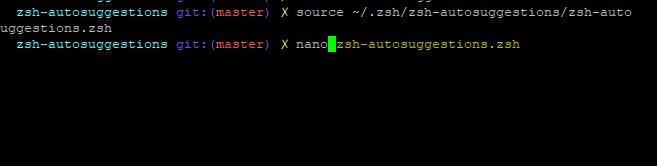  
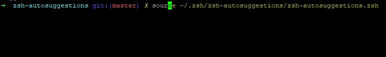  

### 5 Instalación y configuración de tmux  
-Instalamos tmux mediante el siguiente comando: ``~ apt-get install tmux -y``:  
-Luego corremos tmux mediante el comando ``~ tmux`` y debe aparecer lo siguiente:  
-Desde esa sesión, configuramos el archivo tmux.conf para dejar como prefijo la combinación de teclas ctrl + a:  
-Para ejecutar esos cambios sin necesidad de reiniciar tmux, solo basta presionar ``ctrl+b`` y luego ``R``  
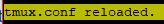  

 Una ves hecho esto podremos hacer todas las funcionalidades de tmux con ``crtl+a``.  
 
-Para activar el modo vi usamos ``ctrl+a [`` y podremos navegar a través del buffer:  
  
  

-Para usar el modo copia visual al portapapeles, solo debemos presionar espacio y movernos con las flechas para resaltar lo que queremos copiar:  
  

-También se puede usar ``enter`` para copiar y ``ctrl+a ]`` para pegar la selección.  

### 6 Sesion tmux de nombre so-exam2  

-Nueva sesión y división de pantalla:  
  
  

-Salida del comando top:  
  

-Peticiones por medio de curl a cada endpoint. Salida formateada con jq:  
-Instalando jq:  
  

-Creación de courses.py:  
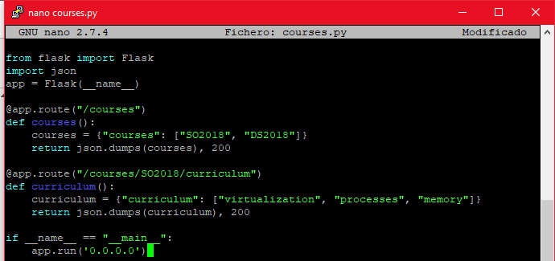  

-Salida de la ejecución del script de python courses.py, peticiones curl y salida jq:  
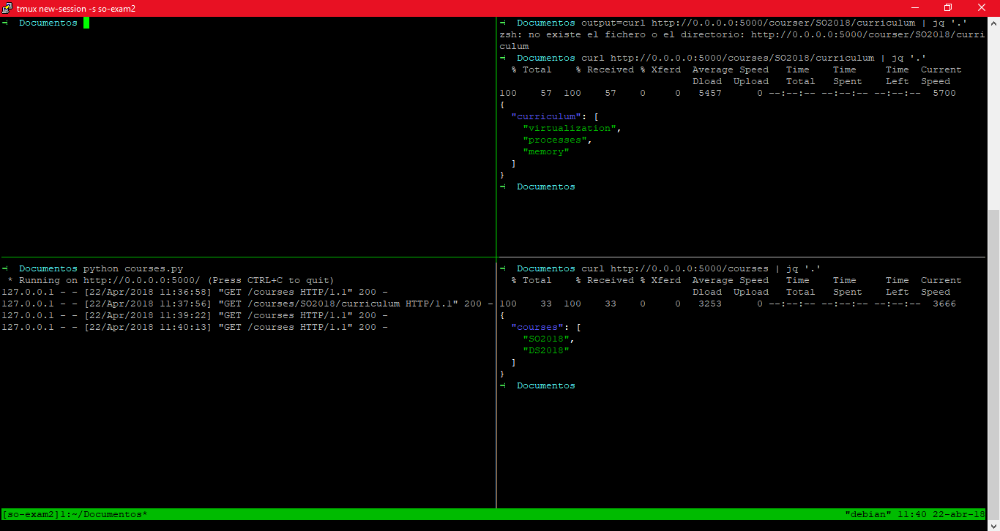  
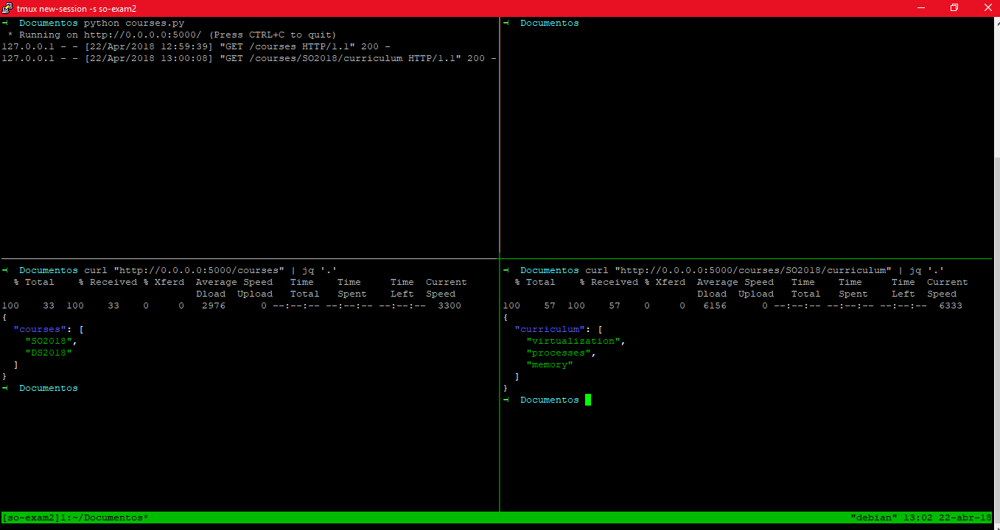  
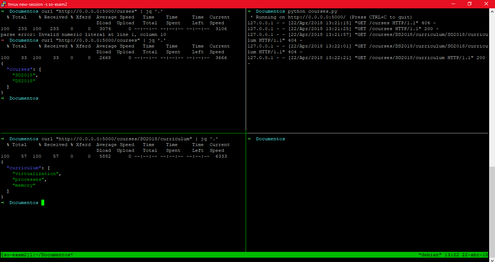  
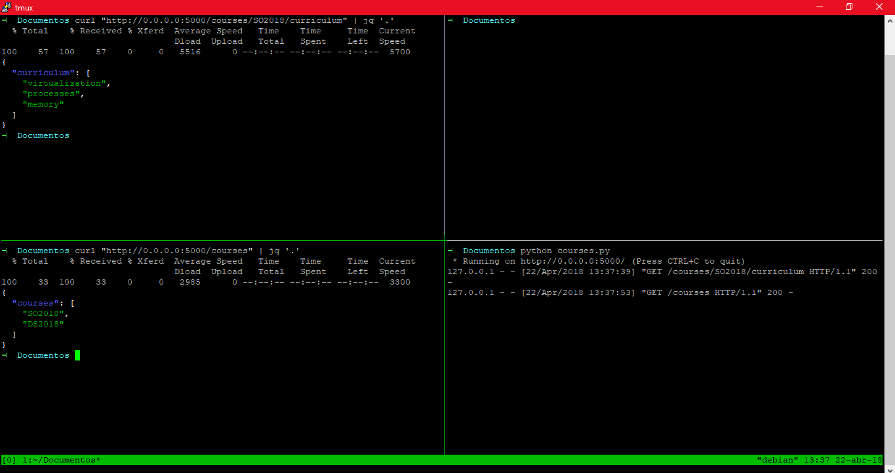  

-Salida de la ejecución de telnet towel.blinkenlights.nl:  
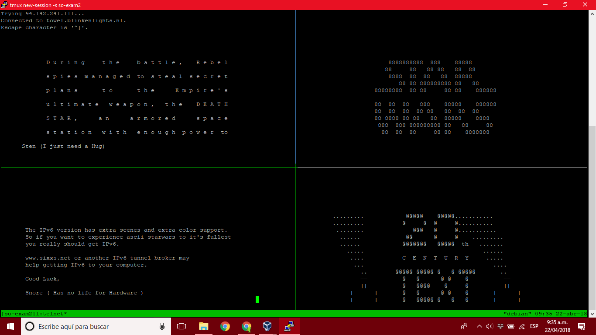  
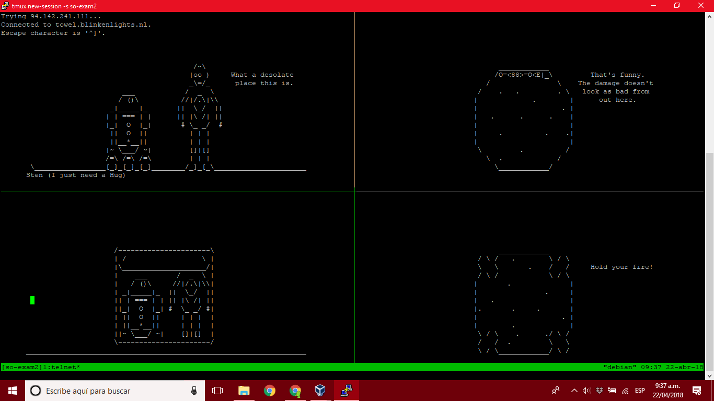  
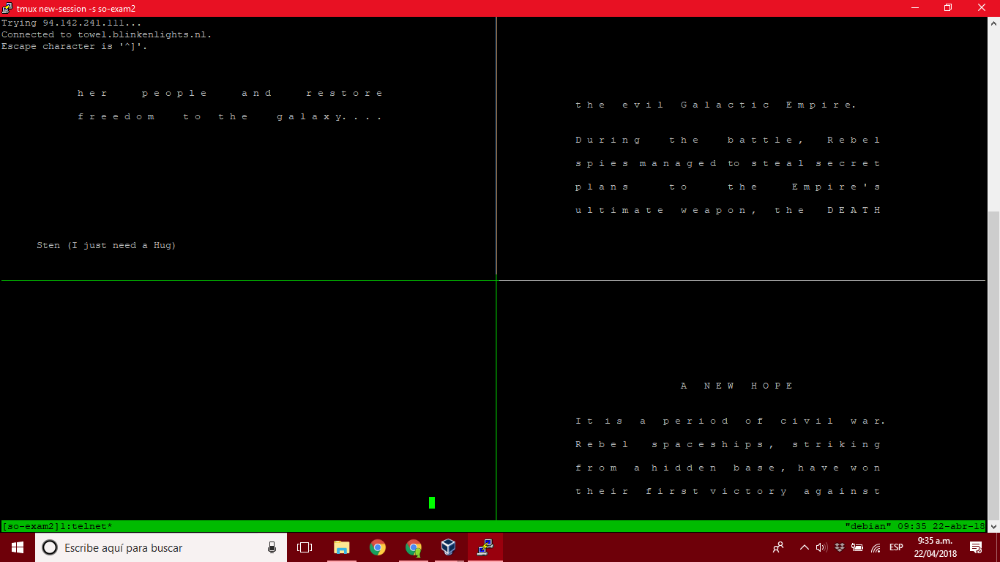  
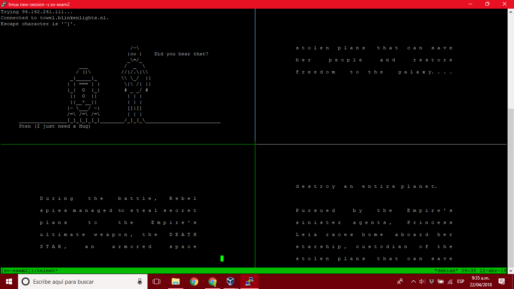  

### 7 Aplicación en background y resultados en slack  

El nombre del algoritmo es consumo y se guardó en un archivo que se llama consumoPC.py, para la realización de ejecución en background, como una aplicación de línea de comandos obteniendo los valores de procesador, memoria y cpu se hizo lo siguiente:  

-Primero se creó el archivo .py a ejecutar y se guardó en la carpeta codigo_punto6:  
  

-Para ejecutarlo como una aplicación de linea de comandos se utilizó la guía https://pythonhosted.org/pyCLI/, entonces en la máquina virtual se tenía que instalar pyCLI esto mediante el comando ``~ pip install pyCLI``.  
En el algoritmo se pone import cli.app.  

-Para obtener los valores de procesador, memoria y disco disponible se debe instalar psutil con el comando ``~ pip install psutil==4.3.0``.  
En el algoritmo se pone import psutil.  

-Debe publicar en un canal de slack los valores de porcentaje de cpu, memoria y disco disponibles:  

  1. Instalamos Slack client con el comando ``~ pip install slackClient``:  
  En el algoritmo se pone from slackclient import SlackClient.  
  
  2. Después de seguir la guía de https://github.com/slackapi/python-slackclient para generar el token del canal de slack y el algoritmo para enviar datos a un canal, se debe copiar el token generado en una línea de código llamada slack_token, y finalmente en text reemplazamos por los datos que debemos enviar al canal que son porcentaje de cpu, memoria y disco disponibles, la línea de código para ello se sacó de https://pypi.python.org/pypi/psutil/4.3.0, entonces el algoritmo completo queda de la siguiente forma:  
   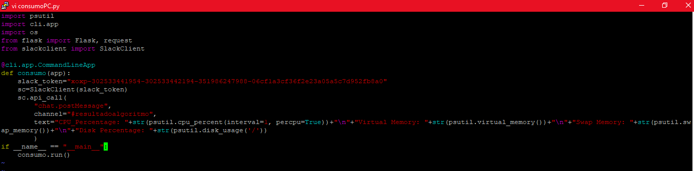  
  
  3. como se pide ejecutar en background, configuré crontab para que el algoritmo se ejecutara cada 10 minutos, para hacer esto se usó el comando ``~ crontab -e``:  
   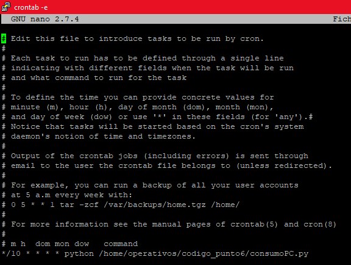  
  
  guardamos la configuración y nos cercioramos de que la configuración se haya guardado con ``~ crontab -l`` y debe salir lo siguiente:  
   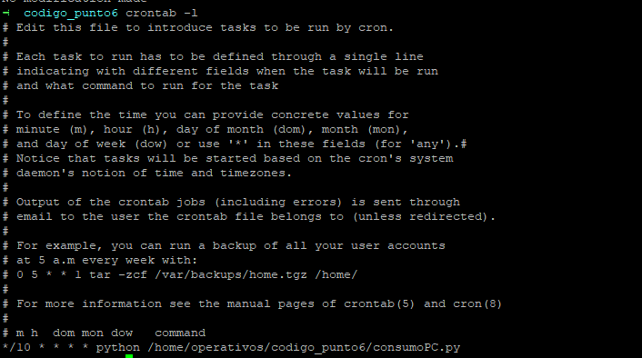  
  
  4. Finalmente esperamos a que el algorimto se ejecute cada 10 minutos y podemos observar en el canal de slack los resultados del algoritmo:  
   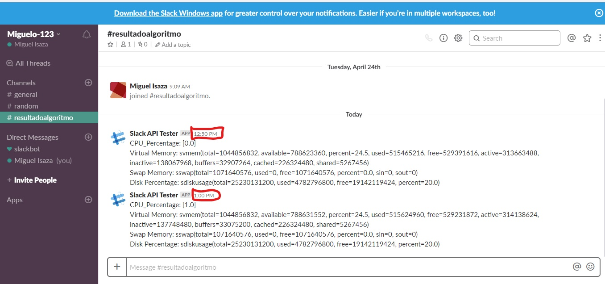  
  
