# Examen Parcial 2 

**Nombre:** Cristian Osorio Trejos  
**Código:** A00056436  
**URL:** [https://github.com/crisosotre/so-exam2/blob/crisosotre/so-exam2/A00056436/README.md](https://github.com/crisosotre/so-exam2/blob/crisosotre/so-exam2/A00056436/README.md)

## Descripción:

El segundo parcial del curso sistemas operativos trata sobre el empleo de comandos de Linux, la instalación y configuración de herramientas y la automatización de tareas.

Este documento será subido al siguiente repositorio: [https://github.com/ICESI-Training/so-exam2](https://github.com/ICESI-Training/so-exam2)

## **Instalación de zsh y git**

Para realizar la instalación de zsh y de git es necesario ingresar como usuario **root** en nuestra maquina virtual. Seguido de eso
ejecutamos el comando ```apt-get install zsh``` para instalar zsh y luego ejecutamos el comando ```apt-get install git``` para instalar git. Este procedimiento se muestra en la siguiente imagen.

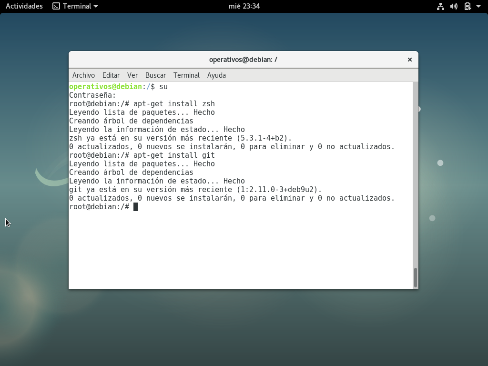
En mi caso zsh y git ya estaban instalados anteriormente.

### **Instalación de oh-my-zsh**

Para realizar la instalacion de oh-my-zsh es necesario instalar **curl** para poder instalarlo.

1) Ejecutamos el comando ```apt-get install curl``` como se muestra en la imagen. En mi caso, ya lo tengo instalado

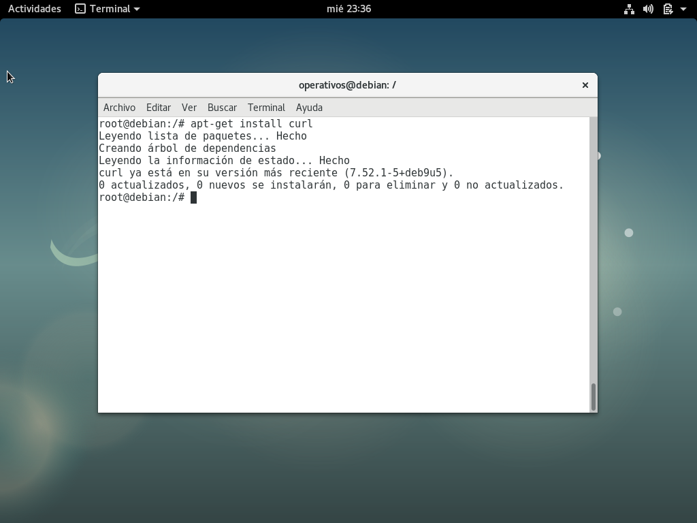

2) Luego ejecutamos el comando ```sh -c "$(curl -fsSL https://raw.githubusercontent.com/robbyrussell/oh-my-zsh/master/tools/install.sh)"``` para instalar oh-my-zsh como usuario root.

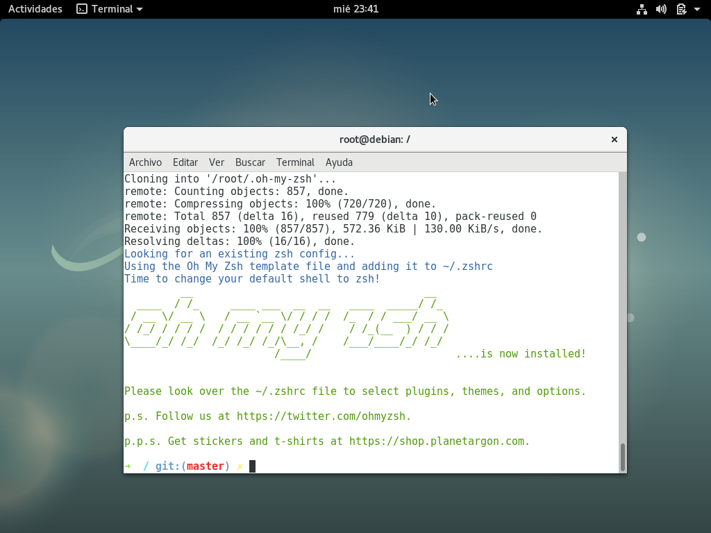

3) Para que oh-my-zsh lo puedan utilizar todos los usuarios, ejecutamos el comando ```export ZSH="$HOME/.dotfiles/oh-my-zsh"; sh -c "$(curl -fsSL https://raw.githubusercontent.com/robbyrussell/oh-my-zsh/master/tools/install.sh)"```.  Ya con esto, todos los usuarios pueden utilizar esta herramienta.

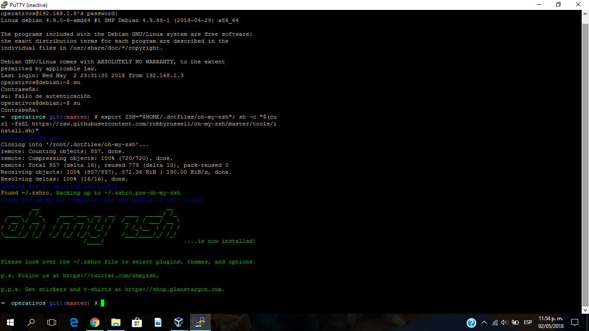

4) Creamos un token para nuestro repositorio de git siguiendo el tutorial:  [https://github.com/ICESI/so-git/tree/master/00_github_intro](https://github.com/ICESI/so-git/tree/master/00_github_intro). Siguiendo el tutorial, primero clonamos el repositorio con  el comando ```git clone```, después configuramos el repositorio con el token generado con el comando ```git config remote.origin.url https://xxxxxxxxxxxxxxxxxxxx@github.com/DonMiguelin/so-exam2.git``` en  XXXXXXXXXXXX ponemos el token que generamos.

5) Para realizar el literal 4, fue necesario crear un directorio en el repositorio clonado con el comando ```mkdir``` y ponerle como nombre **codigo_punto6**, en este directorio cree un archivo **README.md** y lo subi a mi repositorio ejecutando los comandos ```gaa``` que es git add all, ```gcmsg``` git commit -m y ```ggp``` git push origin.

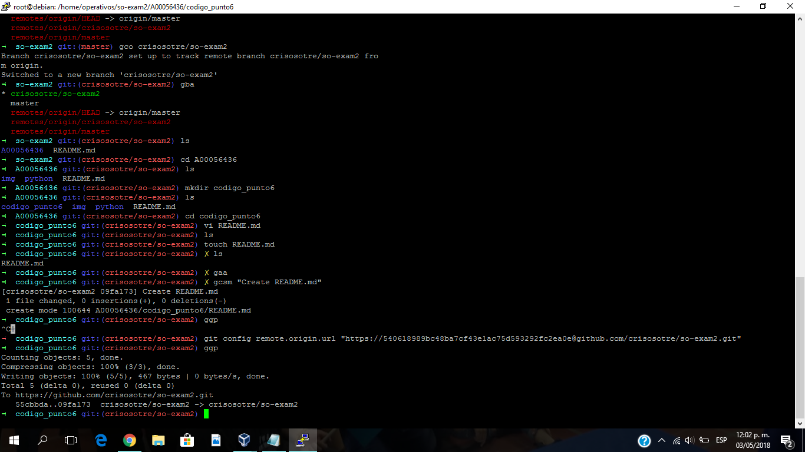


## Instalar plugins de oh-my-zsh

1) El plugin zsh-autosuggestions se utiliza para autocompletar. Para insertar este plugin es necesario ejecutar el comando ```nano ~/.zshrc``` para editar el archivo **zshrc**. una vez ahi buscamos la linea donde se ingresan los plugins y ahi ponemos **git vi-mode zsh-autosuggestions** como se muestra en la imagen:

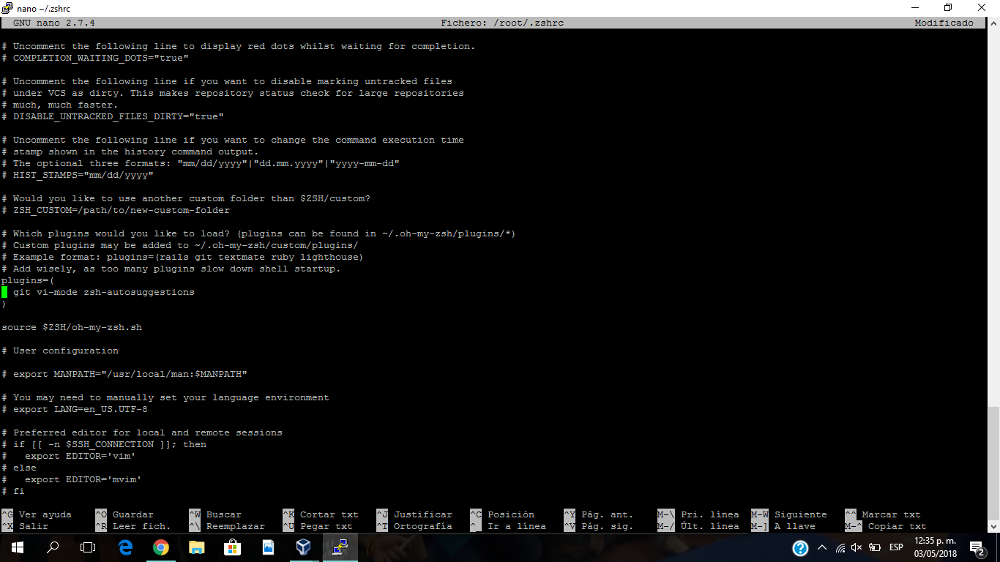

Después ejecutamos el comando ```source ~/.zshrc``` para ver los cambios

2) Luego para modificar el valor para subrayar las sugerencias con un color diferente, en este caso amarillo, ejecutamos el comando ```nano $ZSH_CUSTOM/crisosotre.zsh``` y se creara un archivo .zsh con el nombre que le dimos en el comando. una vez ahi en el modo nano de edición ingresamos lo siguiente: **export ZSH_AUTOSUGGEST_HIGHLIGHT_STYLE="fg=yellow"** cambiando el valor de fg=1 por fg=yellow para que las sugerencias salgan en amarillo. Después ejecutamos el comando ```source ~/.zshrc``` para ver los cambios como se muestra en las siguientes imagenes: 

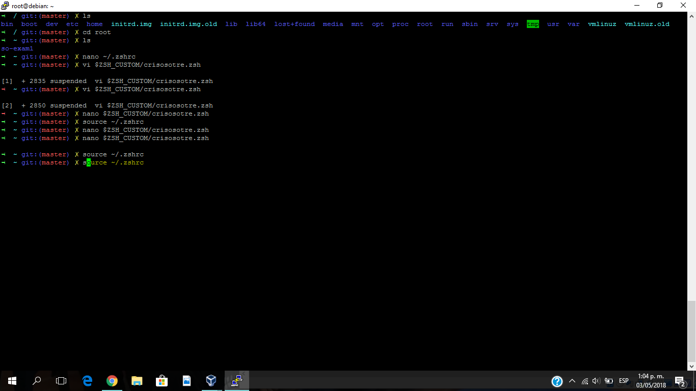

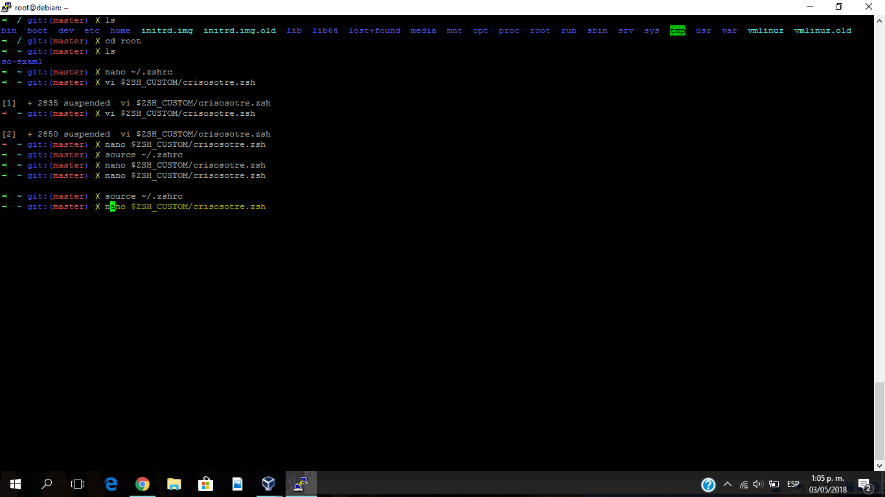

## Instalación y configuración de tmux

Para instalar **tmux** se debe ejecutar el comando ```apt-get install tmux``` y esperamos a que se instale como sucede en la imagen.

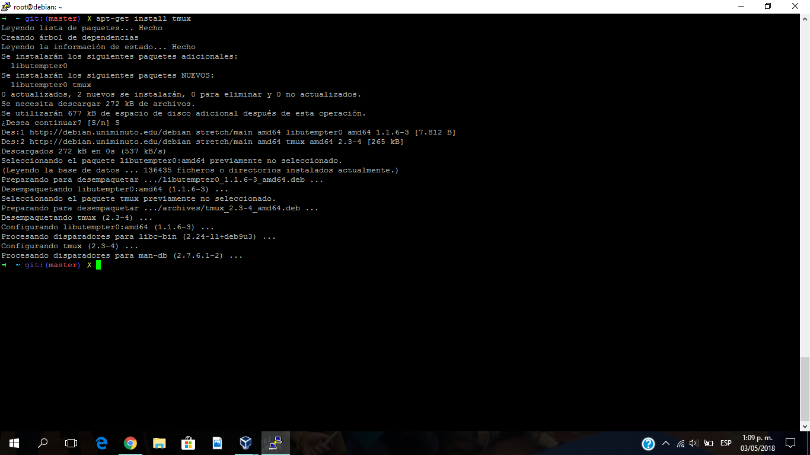

Luego debemos configurar el archivo tmux.conf editandolo con el comando ```nano ~/.tmux.conf``` y una vez en el editor debemos ingresar este script:

```
# use C-a, since it's on the home row and easier to hit than C-b
set-option -g prefix C-a
unbind-key C-a
bind-key C-a send-prefix
set -g base-index 1

# Easy config reload
bind-key R source-file ~/.tmux.conf \; display-message "tmux.conf reloaded."

# vi is good
setw -g mode-keys vi

# Setup 'v' to begin selection as in Vim
bind-key -Tcopy-mode-vi v send -X begin-selection
```
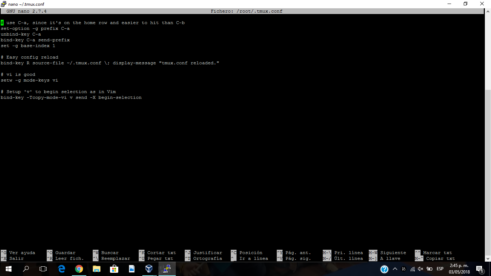

Con esto queda como prefijo la combinación de teclas **ctrl + a**, la recarga de la configuración con el **prefijo** y **R**, también queda activo el modo vi para la navegación a través del buffer (salida de la linea de comandos) y el modo de copia visual a portapapeles.

Ahora se puede utilizar la combinacion de teclas ```ctrl + a + teclas de dirección``` para desplazarse en la pantalla, se puede usar ```ctrl + a + "``` para dividir la pantalla horizontalmente, ```ctrl + a + %``` para dividir la pantalla verticalmente, ```ctrl+a + [``` para entrar en modo vi, ```Espacio``` para seleccionar lo que vamos a copiar, ```Enter``` para hacer la copia, ```q``` para salir del modo vi y ```ctrl + a + ]```

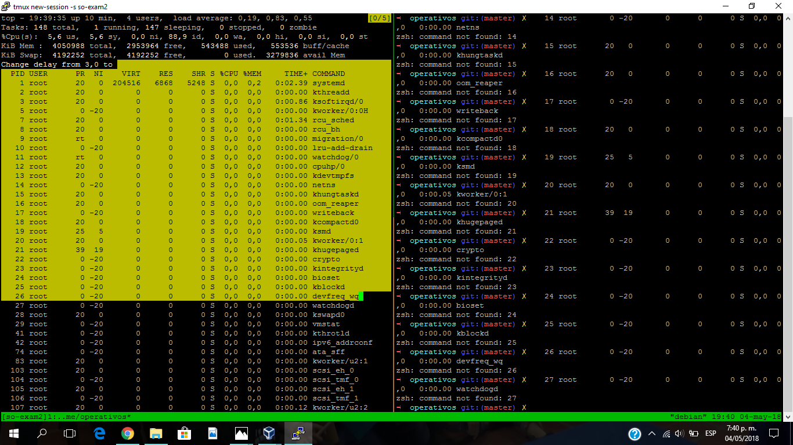

## Sesión so-exam2 con tmux

1) Para crear una sesión con tmux como so-exam2 es necesario ejecutar el comando  ```tmux new-session -s so-exam2```
2) Una vez en sesión dividimos la pantalla en 4 partes
3) En el primer cuadrante ejecutamos el comando ```top```
4) En el segundo cuadrante debemos instalar python pip con el comando ```apt-get install python pip```, seguido de eso instalamos flask con ```pip install flask```, luego instalamos jq con el comado ```apt-get install jq```. Una vez hecho las instalaciones de los programas, creamos el archivo courses.py con el comando ```nano courses.py```.

Una vez en courses.py ingresamos el siguiente codigo:

```
# courses.py
from flask import Flask
import json
app = Flask(__name__)

@app.route("/courses")
def courses():
    courses = {"courses": ["SO2018", "DS2018"]}
    return json.dumps(courses), 200

@app.route("/courses/SO2018/curriculum")
def curriculum():
    curriculum = {"curriculum": ["virtualization", "processes", "memory"]}
    return json.dumps(curriculum), 200

if __name__ == "__main__":
    app.run('0.0.0.0')
```
Guardamos y ejecutamos el archivo courses.py con el comando ```python courses.py```.

5) En el cuadrante inferior derecho teniendo courses.py en ejecución, debemos ejecutar ```curl http://0.0.0.0:5000/courses | jq '.'``` y ```curl http://0.0.0.0:5000/courses/SO2018/curriculum | jq '.'```

6) En el cuadrante restante ejecutamos el comando ```telnet towel.blinkenlights.nl``` en el que veremos un pequeño clip de star wars.

Asi se debe ver la ejecución de todos los comandos hechos anteriormente: 

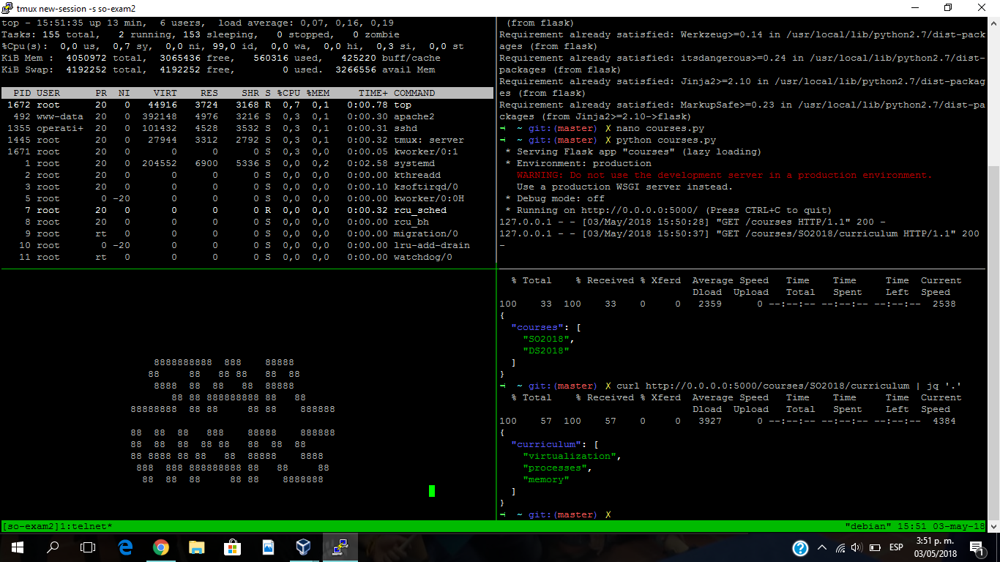


