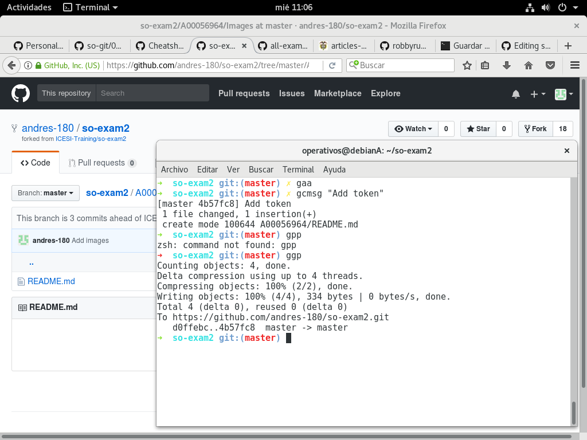
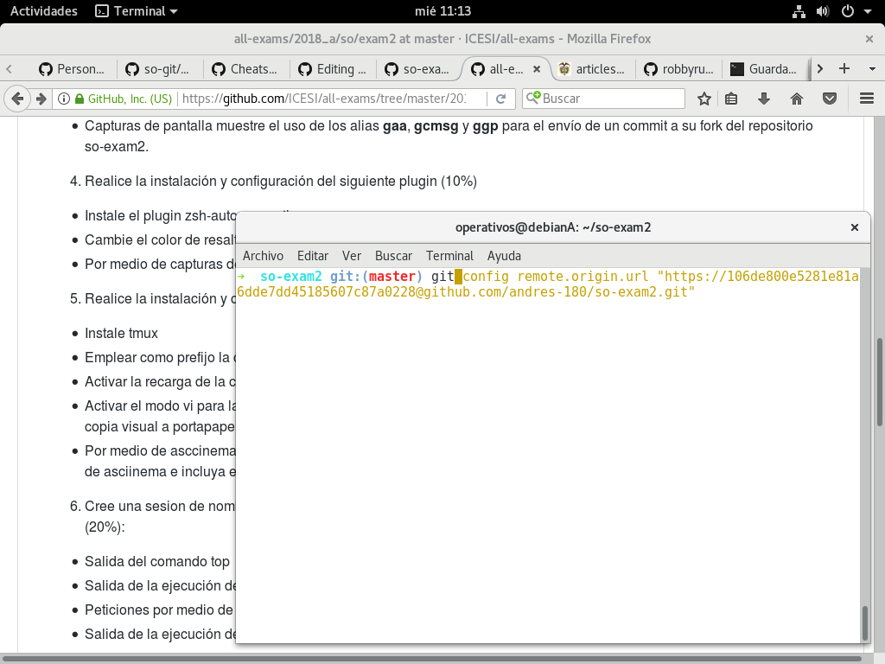
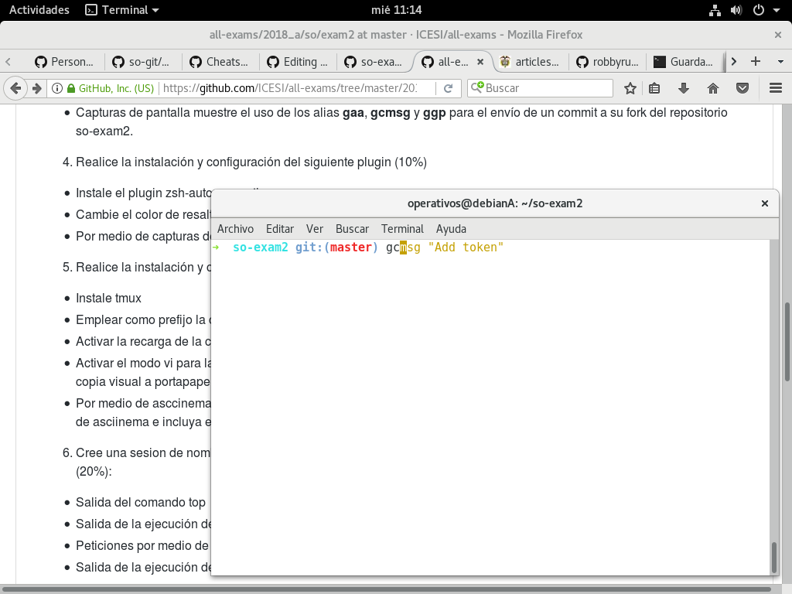
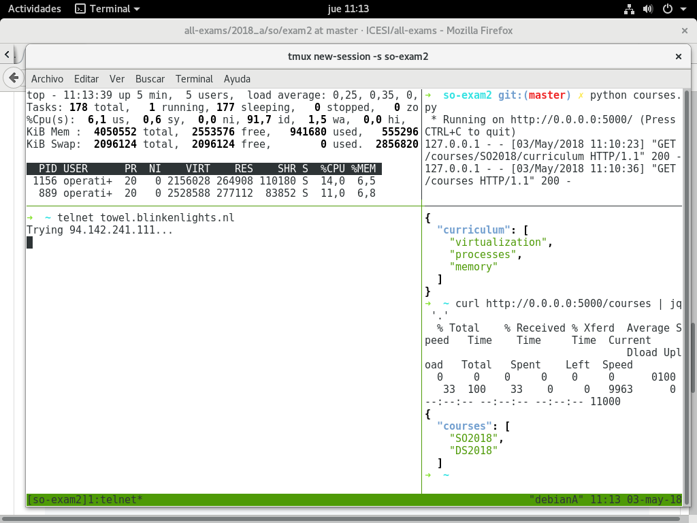

En este documento se ensuentra la solución del parcial 2:   
Punto 1:   
Nombre: Andrés Felipe Pérez Belalcazar   
Código: A00056964  
Punto 3:  
Para realizar la instalación de zsh se usó el siguiente enlace: https://github.com/robbyrussell/oh-my-zsh
El token fue asociado al repositorio del examen, la captura de los comandos de zsh se muestran a continuación:

Punto 4:   
Usando el mismo enlace del punto 3 se pudo configurar el plugin de autosuggestion, los resultados se muestran a continuación:   
Comando 1:

comando 2:

Punto 5:  
Para éste punto se usó la herramienta tmux, se crearón los 4 cuadreantes en donde en el superior izquierdo se encuentra la salida del comando "top", el el superior derecho se muestra la ejecucion del script courses.py, el el inferior izquierdo se visualiza la salida de talnet y en el inferior derecho se visualiza la salida de curl.

