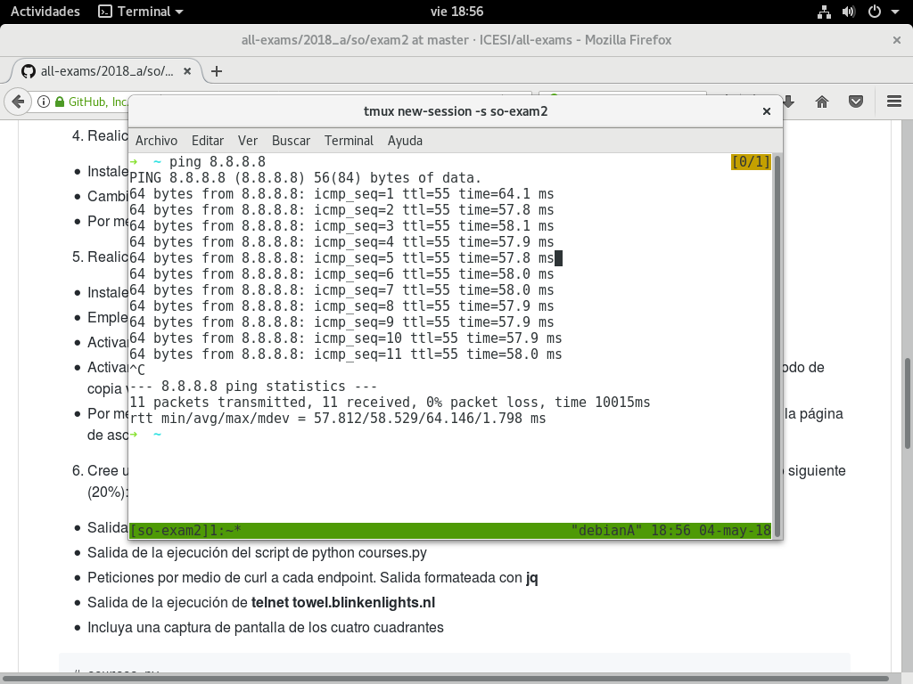
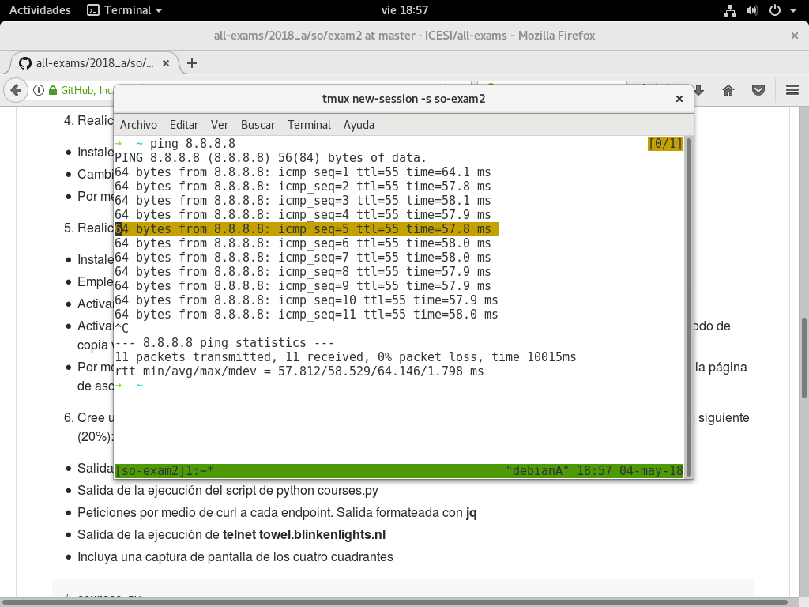
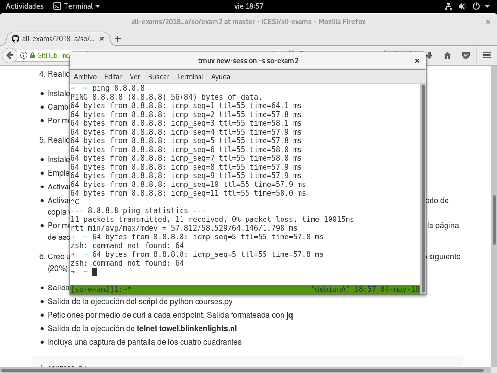
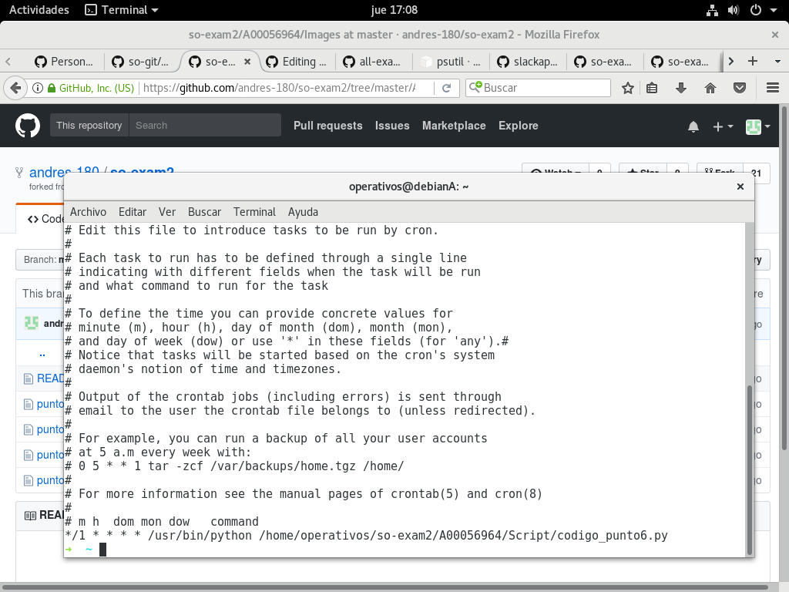
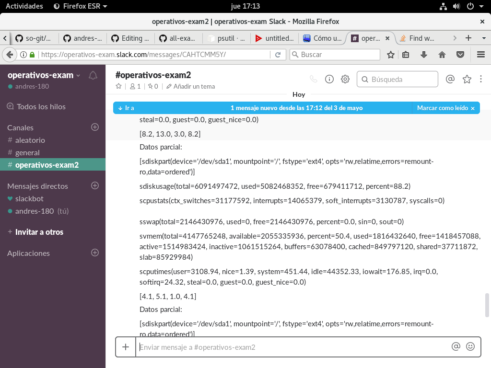

**En este documento se encuentra la solución del parcial 2:**   
# Punto 1: 
**Nombre:** Andrés Felipe Pérez Belalcazar   
**Código:** A00056964  
**Link github (fork):** https://github.com/andres-180/so-exam2  
# Punto 3:  
Para realizar la instalación de zsh se usó el siguiente enlace: https://github.com/robbyrussell/oh-my-zsh.
El token fue asociado al repositorio del examen, la captura de los comandos de zsh se muestran a continuación:

# Punto 4:   
Usando el mismo enlace del punto 3 se pudo configurar el plugin de autosuggestion, los resultados se muestran a continuación:   
Comando 1:

Comando 2:

# Punto 5:
Para empezar, se crea una sesión en tmux con el nombre de so-exam2. A continuación se muestra la navegación con el modo vi:

Ahora se puede visualizar la selección de lo que se copiará al portapapeles:

Por último, se visualiza lo que se copió al portapapeles en la consola:

# Punto 6:  
Para éste punto se usó la herramienta tmux, se crearón los 4 cuadreantes en donde en el superior izquierdo se encuentra la salida del comando "top", el el superior derecho se muestra la ejecucion del script courses.py, el el inferior izquierdo se visualiza la salida de talnet y en el inferior derecho se visualiza la salida de curl.

# Punto 7:  
El programa en python se encuentra en la carpeta Script (https://github.com/andres-180/so-exam2/blob/master/A00056964/Script/codigo_punto6.py) y acontinuación se muestra la configuración del archivo de crontab:

En este caso se ha programado crontab para que se ejecute cada minuto, en Slack podemos ver que en efecto se publica en el canal cada 1 minuto:

