### Exam 2  
**Universidad ICESI**  
**Curso:** Sistemas Operativos  
**Docente:** Daniel Barragán C.  
**Tema:** Comandos de Linux, Scripts, Herramientas  
**Código:** A000056992  
**Repositorio git:** https://github.com/estivenLandazury/so-exam2/  
**Nombre:** Estiven Landázury Salazar 
### PUNTO 3: INSTALACIÓN Y CONFIGURACIÓN DE ZSH Y GIT  

En este punto se realizó la instalación de ZSH y git en la imagen a continuación se evidencia:

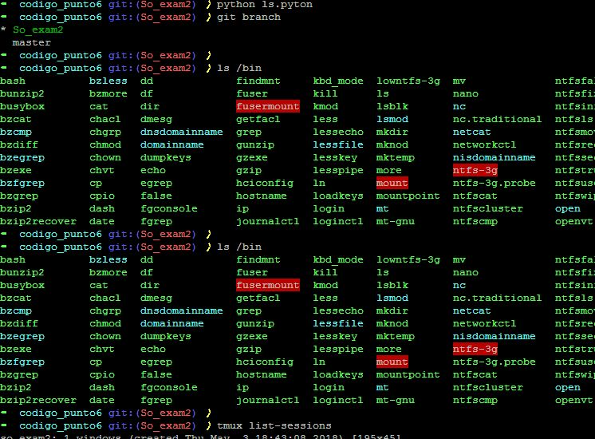  

Una vez instalado Oh-My-Zsh procedemos a instalar uno de sus plugins que sugiere el autocompletado de comandos previamente invocados por el usuario usando el siguiente comando:
git clone https://github.com/zsh-users/zsh-autosuggestions $ZSH_CUSTOM/plugins/zsh-autosuggestions  

Despues fue necesario configurar el Uso de un token en lugar de usuario y contraseña para la conexión con git, la imagen acontinuación lo evidencia:  
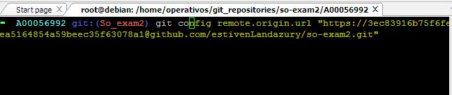  

Acontinuación se muestra  la evidencia del plugin de autocompletado de zsh:  
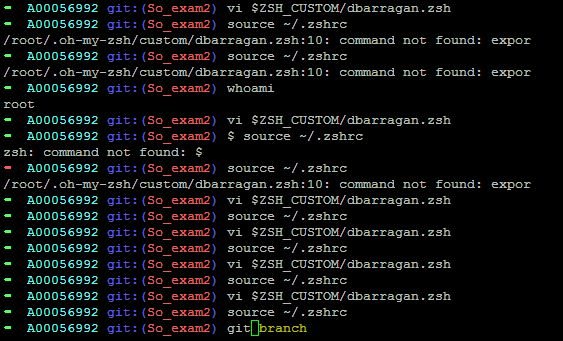  

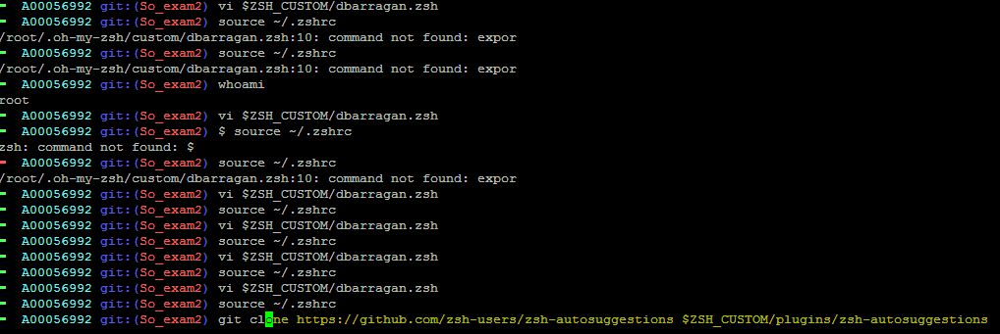  

Una vez configurado el token y ZSH, podemos dar evidencia del uso de las abreviaturas para realizar comit al repositorio.  

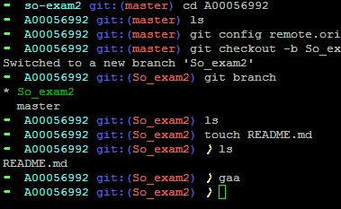  

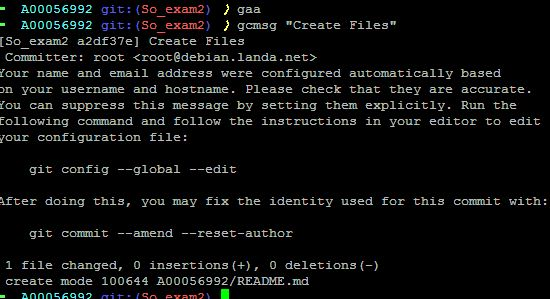  

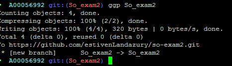 

### PUNTO 4: Instalación y configuración del plugin  

En este punto es necesarrio evidenciar que el color de resaltado de las coincidencias es amarillo, como se muestra en la imagen:

  

El plugin de autocompletado, se evidenció en una de las imágenes más arriba.  

### PUNTO 5: Realice la instalación y configuración de tmux.  

Se instala tmux usando el siguiente comando:  

sudo apt-get install tmux  

Una vez instalado tmux, se cambiara aspectos de  configuración para facilitar el uso de atajos de teclado, en este caso se cambiaran comandos 
como ctrl+a = ctrl+b. De igual forma se activara vi-mode y la selección, usando el siguiente comando:  

vi ~/.tmux.conf  

Dentro de este archivo se especifica la siguiente configuración:  
#use C-a, since it's on the home row and easier to hit than C-b  
set-option -g prefix C-a  
unbind-key C-a  
bind-key C-a send-prefix  
set -g base-index 1  

#Easy config reload  
bind-key R source-file ~/.tmux.conf \; display-message "tmux.conf reloaded."  

#vi is good  
setw -g mode-keys vi  

#Setup 'v' to begin selection as in Vim  
bind-key -Tcopy-mode-vi v send -X begin-selection  

Una vez configurado tmux es posible activar el modo vi para la navegación a través del buffer, La siguinte imagen da evidencia  

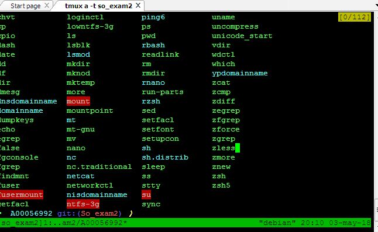  

También es posible seleccionar algunos caracteres, presionando la tecla espacio:  

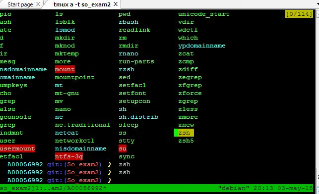 

Igualmente se copia lo selecionado, presionando la tecla enter:

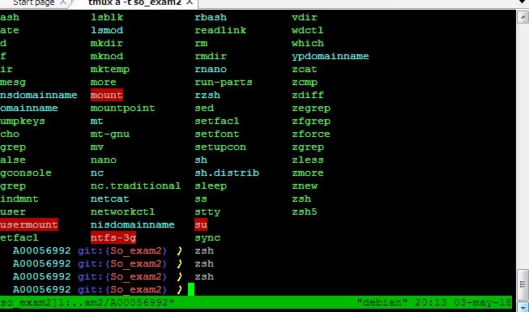  

### PUNTO 6: Cree una sesion de nombre so-exam2. Divide la pantalla en cuatro cuadrantes y en cada cuadrante muestre lo siguiente.  

Salida del comando top  
Salida de la ejecución del script de python courses.py  
Peticiones por medio de curl a cada endpoint. Salida formateada con jq  
Salida de la ejecución de telnet towel.blinkenlights.nl  

En la imagen acontinuación se evidencian cada uno de los comandos ejecutados:

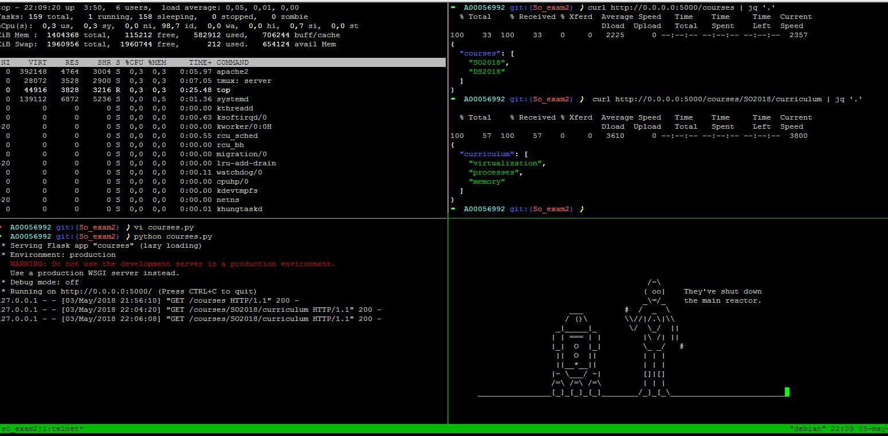

### PUNTO 7: Aplicación crontab  

Para la configuracion del script de Python, es necesario instalar lo siguiente:

pyCLI    
psutil 4.3.0    
pip install slackclient  

Una vez instalados, se crea una  carpeta  llamada codigo_punto6 se crea un script de python con el cual, importando psutil, podremos obtener
las estadisticas del sistema y por medio de slackclient se enviaran estos datos en forma de mensaje cada cierto tiempo. 

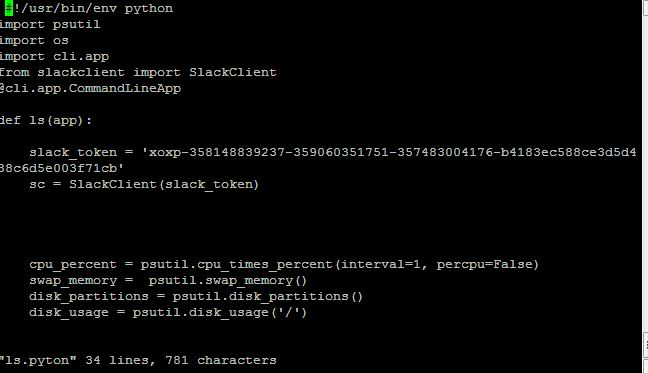  

Para lograr ejecutar este programa y que cada mi nuto me envie la información de mi pc, se ejecutó el siguiente comando:  
 
 crontab -e  
 
 y dentro de este archivo se añadió la última linea de codigo que se puede observar: 
 
 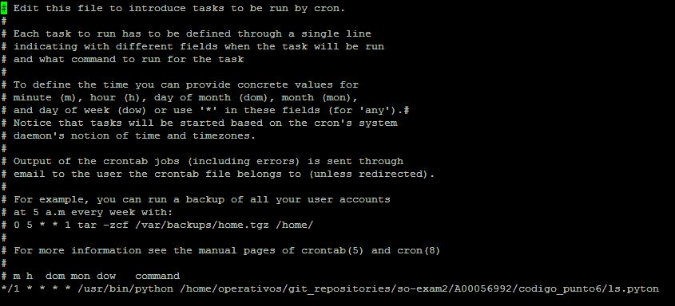  
 
 Guardamos el archivo y asi finalmente se encontraria configurada una tarea con el script que se creo anteriormente con repetición cada minuto  
 
 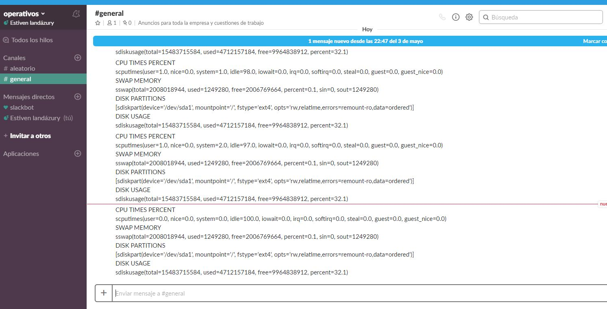 
 
 

