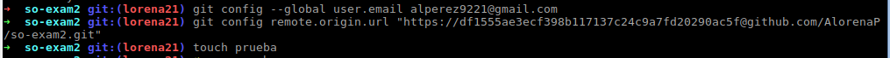

### EXAMEN 2  
**Nombre:** Angie Lorena Pérez  
**Código:** A00242068  
**Materia:** Sistemas operacionales
**Tema: Comandos de Linux, Scripts, Herramientas
**Correo personal:** lorena9221@hotmail.com  
**URL repositorio:** https://github.com/AlorenaP/so-exam2.git

### 3 Instalación y configuración de zsh y git  
-Instalación de git usando el siguiente comando: ``# apt-get install git`` 

-Instalación de zsh y plugin Oh-my-zsh 

comando: ``# apt-get install zsh``

comando:``# sh -c "$(curl -fsSL https://raw.githubusercontent.com/robbyrussell/oh-my-zsh/master/tools/install.sh)"``

-Siguiendo la guia de conexion con git a través del uso de un token

uan vez conectados por medio desde el token, ejecutamos los alias gaa, gcmsg y ggp para el envío de un commit

### 4 Instalación y configuración del plugin zsh-autosuggestions

clonamos de: ``# git clone https://github.com/zsh-users/zsh-autosuggestions $ZSH_CUSTOM/plugins/zsh-autosuggestions ``

y se agrega al list de plugins ``#plugins = (zsh-autosuggestions)``

-Cambio de color a amarillo en ``# ZSH_AUTOSUGGEST_HIGHLIGHT_STYLE='fg=yellow' ``

evidenciando en los autocompletados que se resaltan de color amarillo

### 5 Instalación y configuración de tmux

-Instalamos tmux con el siguiente comando: ``apt-get install tmux ``

-Luego corremos tmux mediante el comando ``tmux`` 

  

-Desde esta sesión, configuramos el archivo tmux.conf para dejar como prefijo la combinación de teclas ctrl + a:  

-Para ejecutar efectuar el cambio presionamos ``ctrl+b`` y luego ``R``  

-Una vez hecho esto ejecutamos todas las funcionalidades de tmux con el prefijo ``crtl+a``.  

-Ahora para activar el modo vi, primero debemos instalarlo mediante el comando ``apt-get install vim``  

  

-Para activar este modo usamos ``ctrl+a [`` y podremos navegar a través del buffer con la tecla espaciadora y las flechas:  

  

### 6 Sesion tmux de nombre so-exam2 

