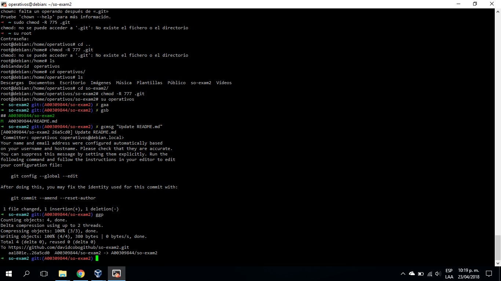

# Segundo Parcial
 
**Nombre:** David Felipe Cobo Plazas

**Código:** A00309844

**URL repositorio:** https://github.com/davidcobogithub/so-exam2.git 

**Tabla de Contenido**

  - [1. Descarga y validación del ISO de Debian 9]
  - [2. Instalación de Debian 9 en VirtualBox]
  - [3. Configuración de red para la conexión a través de Putty]
  - [4. Instalación de git y tig]
  - [5. Exportación de la máquina virtual]
  - [6. Importación de la máquina virtual]
  - [7. Cuadro comparativo entre Debian 9 y CentOS7]
 
# Solución Parcial 2

##  1. Instalación de zsh

**1.** Se escribe el siguiente comando ```apt-get install zsh -y```

**2.** Para instalar los plugins de oh-my-zsh se debe ejecutar el comando ```sh -c "$(curl -fsSL https://raw.githubusercontent.com/robbyrussell/oh-my-zsh/master/tools/install.sh)"```

**3.** Nota: Si no tiene instalado curl, debe instalarse. También funciona con el comando ```wget https://github.com/robbyrussell/oh-my-zsh/raw/master/tools/install.sh -O - | zsh```

**4.** Para habilitar el plugin vi-mode se deben realizar los comandos: ```$ vi ~/.zshrc
plugins=(git vi-mode)
$ source ~/.zshrc```

**5.** Para configurar el token se debe clonar el repositorio. en mi caso el comando es ```git clone https://github.com/davidcobogithub/so-exam2.git```

**6.** Configure el token como medio de autenticación a GitHub con el comando ```git config remote.origin.url "https://topSecretToken@github.com/davidcobogithub/so-exam2.git"```

**7.** Ahora, algunas capturas de pantalla mostrando el uso de los alias gaa, gcmsg y ggp para el envío de un commit:



##  2. Instalación del plugin zsh-autosuggestions
