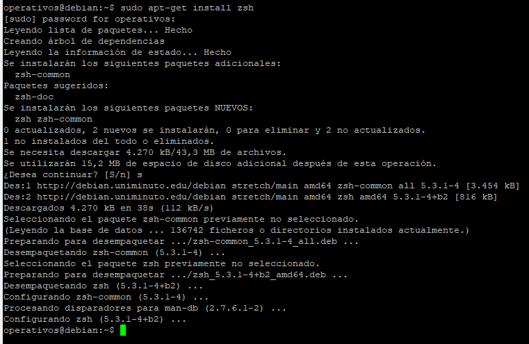
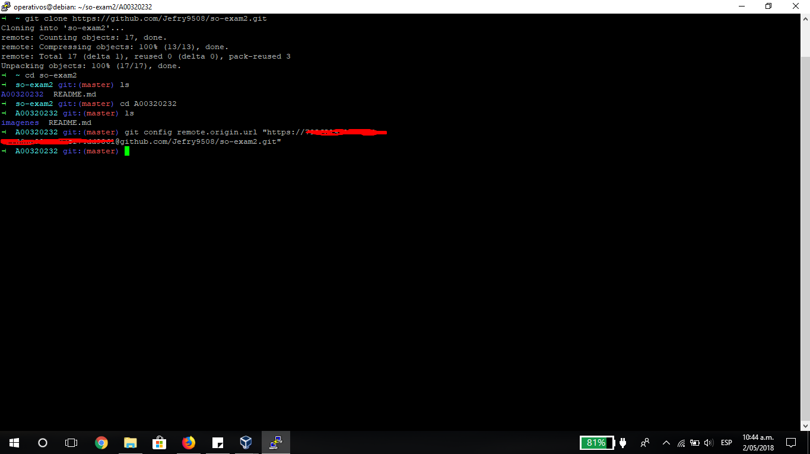
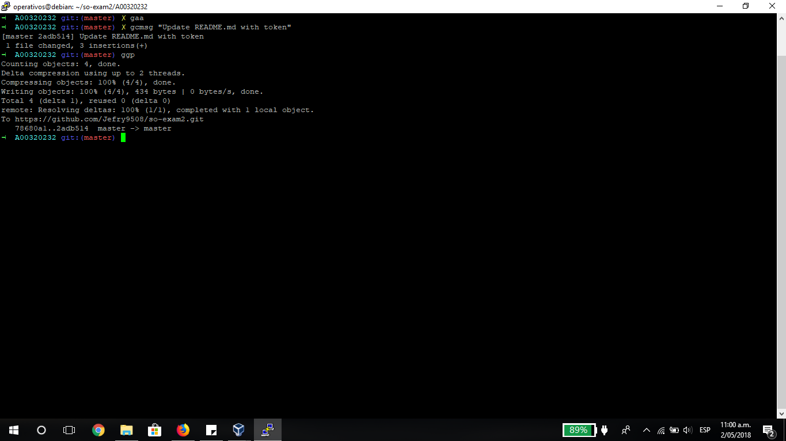
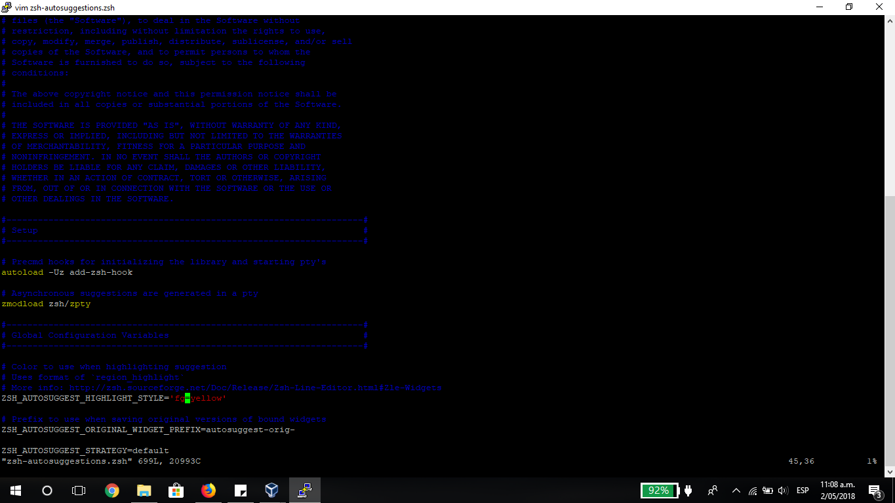

# Sistemas Operacionales - Parcial 2  

**Nombre:** Jefry Cardona Chilito  
**Código:** A00320232  
**Correo:** jefry.cardona@correo.icesi.edu.co  
**Profesor:** Daniel Barragan  
**Url repositorio:** https://github.com/Jefry9508/so-exam2  


## Instañación zsh

Para la instalación de zsh se utilizó el comando
```console
apt-get install zsh
```



## Instalación de plugins de oh-my-zsh

Para realizar la instalción de oh-my-zsh se utilizó el siguiente comando
```console
apt-get install zsh
```


## Configuración token

Se siguió la guía referenciada en el enunciado del parcial con lo cual se obtuvo el token para el fork del repositorio del parcial.


Luego se configuró la cuenta de github asociada a la máquina para que en los proximos commit no vuelva a pedir validación de cuenta de la siguiente manera.



## Uso de los alias gaa, gcmsg y ggp 

Se modificó el README.md para poder realizar un commit.



##  Instalación y configuración del plugin zsh-autosuggestions

Para instalar el plugin se utilizó el comando
```console
git clone https://github.com/zsh-users/zsh-autosuggestions ~/.zsh/zsh-autosuggestions
```

Luego, se ejecuta el siguiente comando para que los cambios tegan efecto
```console
source ~/.zsh/zsh-autosuggestions/zsh-autosuggestions.zsh
```

Posteriormente accedemos a la carpeta donde se descargó el plugin.
```console
~/.zsh/zsh-autosuggestions
```
y editamos el archivo de configuración con
```console
vim zsh-autosuggestions.zsh
```
Configuramos la opción ZHS_AUTOSUGGEST_HIGHLIGHT_STYLE como sigue:



Volvemos a compilar el plugin con:
```console
source ~/.zsh/zsh-autosuggestions/zsh-autosuggestions.zsh
```

Y ya podemos comprobar que los cambios han surtido efecto.


