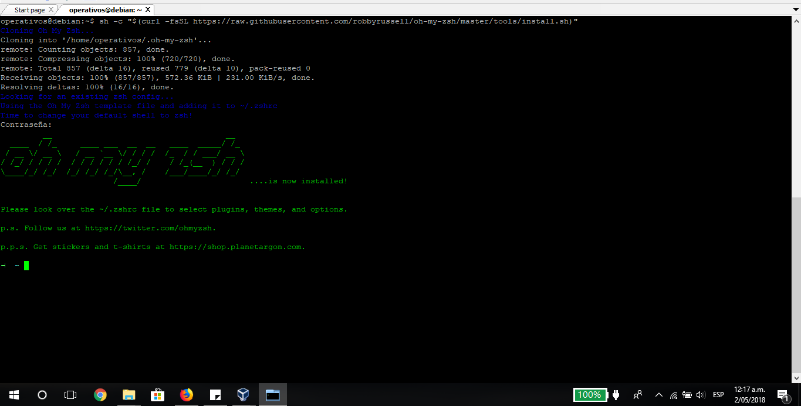
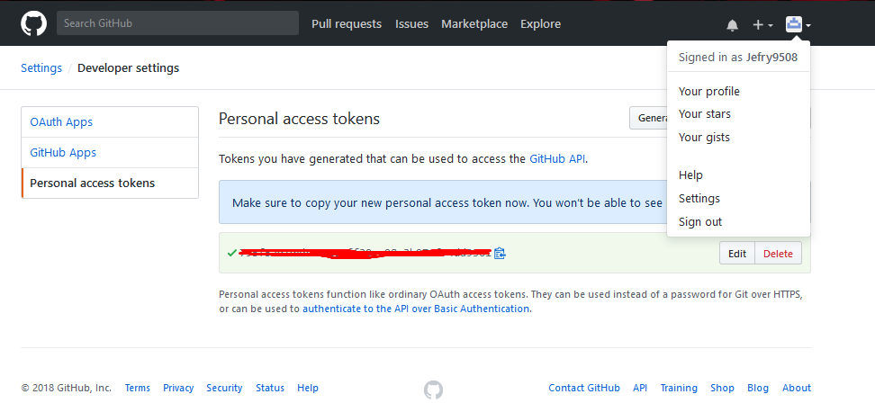
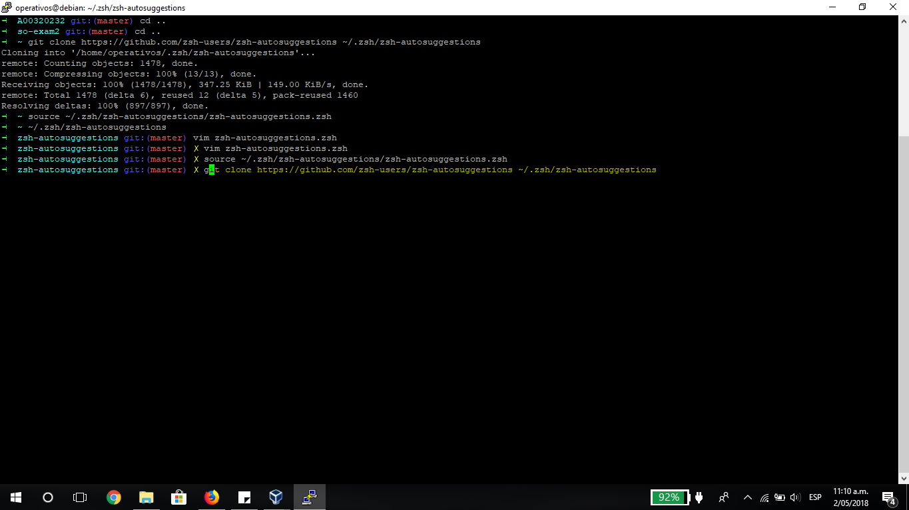

# Sistemas Operacionales - Parcial 2  

**Nombre:** Jefry Cardona Chilito  
**Código:** A00320232  
**Correo:** jefry.cardona@correo.icesi.edu.co  
**Profesor:** Daniel Barragan  
**Url repositorio:** https://github.com/Jefry9508/so-exam2  


## Instañación zsh

Para la instalación de zsh se utilizó el comando
```console
apt-get install zsh
```


## Instalación de plugins de oh-my-zsh

Para realizar la instalción de oh-my-zsh se utilizó el siguiente comando
```console
apt-get install zsh
```


## Configuración token

Se siguió la guía referenciada en el enunciado del parcial con lo cual se obtuvo el token para el fork del repositorio del parcial.



Luego se configuró la cuenta de github asociada a la máquina para que en los proximos commit no vuelva a pedir validación de cuenta de la siguiente manera.


## Uso de los alias gaa, gcmsg y ggp 

Se modificó el README.md para poder realizar un commit.


##  Instalación y configuración del plugin zsh-autosuggestions

Para instalar el plugin se utilizó el comando
```console
git clone https://github.com/zsh-users/zsh-autosuggestions ~/.zsh/zsh-autosuggestions
```

Luego, se ejecuta el siguiente comando para que los cambios tegan efecto
```console
source ~/.zsh/zsh-autosuggestions/zsh-autosuggestions.zsh
```

Posteriormente accedemos a la carpeta donde se descargó el plugin.
```console
~/.zsh/zsh-autosuggestions
```
y editamos el archivo de configuración con
```console
vim zsh-autosuggestions.zsh
```
Configuramos la opción ZHS_AUTOSUGGEST_HIGHLIGHT_STYLE como sigue:


Volvemos a compilar el plugin con:
```console
source ~/.zsh/zsh-autosuggestions/zsh-autosuggestions.zsh
```

Y ya podemos comprobar que los cambios han surtido efecto.



## Uso e instalación de tmux

Para realizar la instalación de tmux se utilizó el siguiente comando
```console
apt-get install tmux -y
```

Luego de la instalación ejecutamos el comando
```console
tmux
```

Esto para abrir el tmux en nustra terminal. Hecho esto, el siguiente paso a seguir es configurar tmux. Para realizar esto debemos editar el archivo tmux.conf ejecutando el siguiente comando
```console
vim ~/.tmux.conf
```
Cuando abra el editor de texto, debemos copiar las siguientes instrucciones dentro del archivo:
```
# use C-a, since it's on the home row and easier to hit than C-b
set-option -g prefix C-a
unbind-key C-a
bind-key C-a send-prefix
set -g base-index 1

# Easy config reload
bind-key R source-file ~/.tmux.conf \; display-message "tmux.conf reloaded."

# vi is good
setw -g mode-keys vi

# Setup 'v' to begin selection as in Vim
bind-key -Tcopy-mode-vi v send -X begin-selection
```

Guardamos el archivo y salimos del editor. Luego presionamos la configuración de teclas ctrl+b y luego r para que tmux realice los cambios necesarios . Una vez hecho esto, ya tendremos habilitado el modo vi para navegar a través del buffer, se habrán cambiado la combinación de teclas ctrl+b por ctrl+a y y tedremos habilitado la opción de reload para tmux.


## Salidas en los cuatro cuadrantes de tmux

Se creó una sesión en tmux con el comando
```console
tmux new-session -s so-exam2
```

Luego se ejecutaron las siguiente lista de instrucciones en cada uno de los cudrantes respectivamente:

1. Salida del comando top
2. Salida de la ejecución del script de python courses.py
3. Peticiones por medio de curl a cada endpoint. Salida formateada con jq
4. Salida de la ejecución de telnet towel.blinkenlights.nl


## Construcción de aplicación 

Se pide construir una aplicación que se debe ejecutar en background cada cierto tiempo, se debe ejecutar como una aplicación de linea de comandos, debe obtener los valores de procesador, memoria y disco disponibles y debe publicar en un canal de slack los valores de porcentaje de cpu, memoria y disco disponibles. Para esto, es necesario instalar las siguientes librerias:

1. pyCLI usando el comando
```console
pip install pyCLI
```

2. psutil 4.3.0
```console
pip install psutil==4.3.0
```

3. python-slackclient
```console
pip install slackclient
```
