### Examen 2
**Universidad ICESI**  
**Curso:** Sistemas Operativos  
**Estudiante:** Santiago Fajardo  
**Codigo:** A00328044  
**Tema:** Comandos de Linux, Scripts, Herramientas  
**Correo:** santiago_fajardo96@hotmail.com

### Descripción
El segundo parcial del curso sistemas operativos trata sobre el empleo de comandos de Linux, la instalación y configuración deherramientas y la automatización de tareas.  
URL del repositorio: https://github.com/santyfajardo/so-exam2.git

## Punto 1
Nombre y código agregados
## Punto 2
Ortografía
## Punto 3
- zsh instalado  
- Plugins oh-my-zsh instalados  
- Token creado e utilizado  
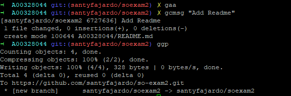
## Punto 4
- Plugin zsh-autosuggestion instalado  
- Color modificado a amarillo para el resaltado  
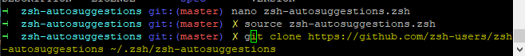
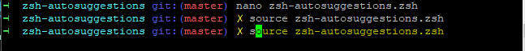
## Punto 5
- Tmux instalado  
- Creación y modificación del archivo tmux.config
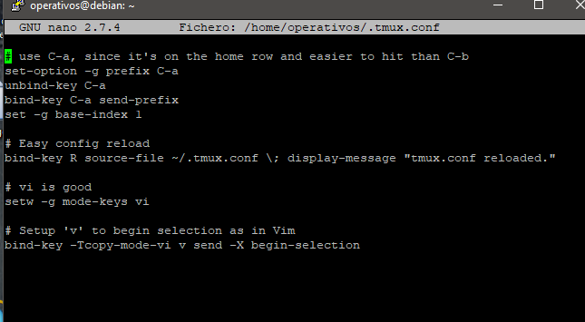  
Moverse a través de los comandos    
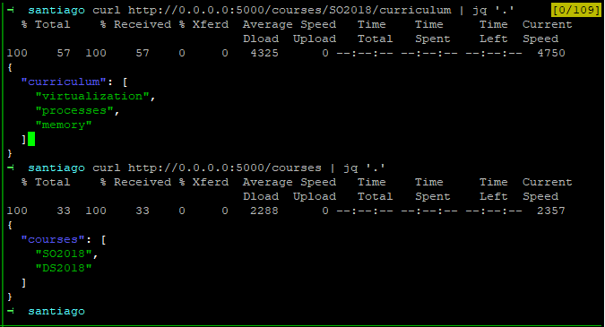  
Seleccionar los comandos    
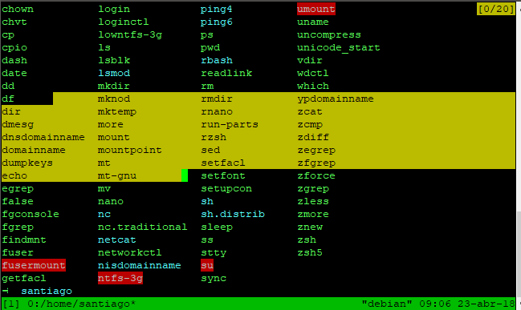
## Punto 6
- Salida comando top
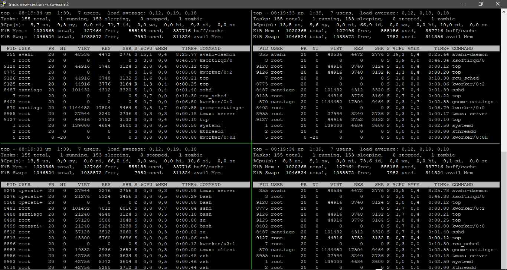  
- Salida de la ejecución de courses.py en los cuatro cuadrantes con las respectivas peticiones  
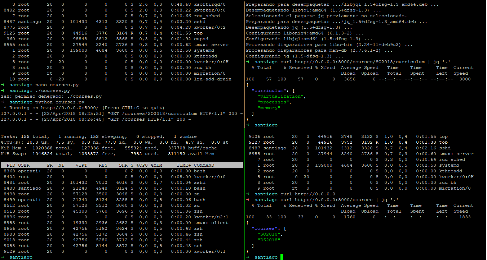
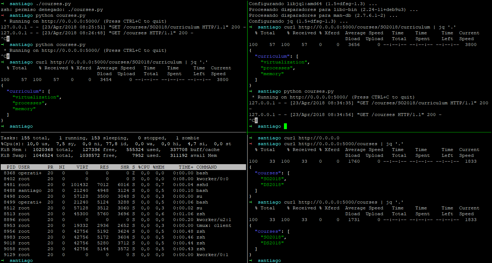
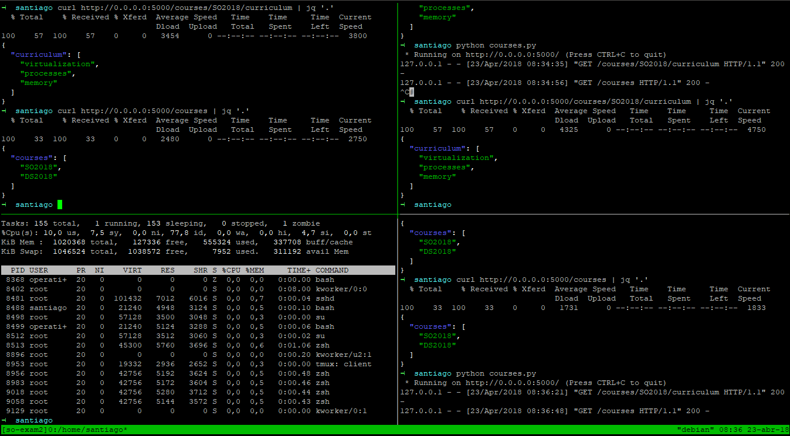
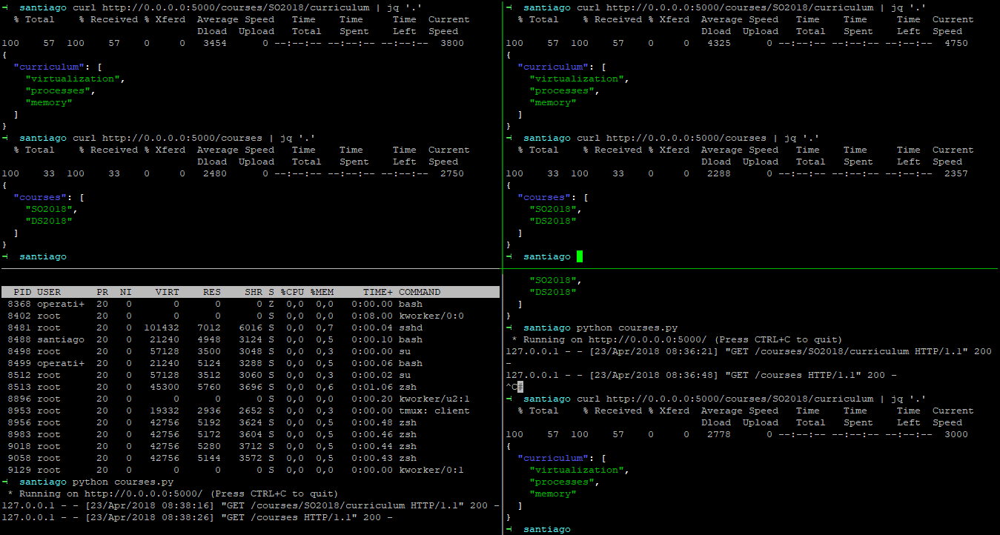  
- Salida de telnet towel.blinkenlights.nl

## Punto 7
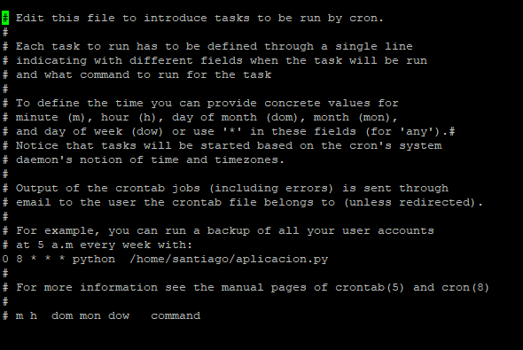
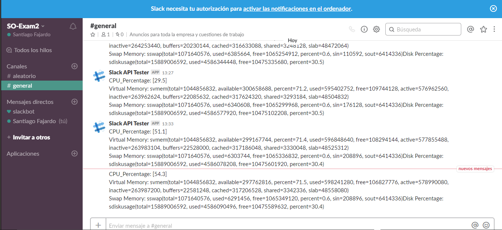
