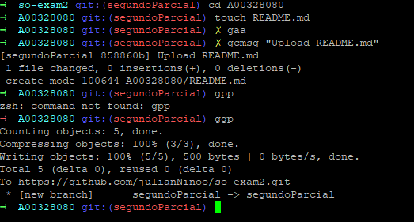

**Segundo Examen Parcial**  

**Universidad Icesi**  

**Materia:** Sistemas Operativos  
**Nombre:** Julián Niño  
**Código:** A00328080  
**Correo:** juliannino01@hotmail.com  
**Segundo Correo:** julian.nino@correo.icesi.edu.co  
**URL:** https://github.com/julianNinoo/so-exam2  

**Descripción**  

Este Segundo Examen Parcial consiste en el empleo de comandos de herramientas y la automatización de tareas.  

**Punto 1**   
Las asignaciones como nombre, código, correo y materia han sido agregados. 

**Punto 2**  
Punto relacionado con la ortografía.  
**Punto 3**  
Se instala zsh y oh-my-szh, que tiene varias abreviaciones para diferentes comandos de git.
 

