## SO-EXAM 1

**Nombre:** Joan Sebastián García Delgado

**Código:** A00329796

## Descripción

Realizar segundo parcial del curso Sistemas Operativos Universidad Icesi

## Solución

**1 Punto** Nombre y código agregados 

**2 Punto** Ortografía y redacción

**3 Punto** 
Instalación zsh
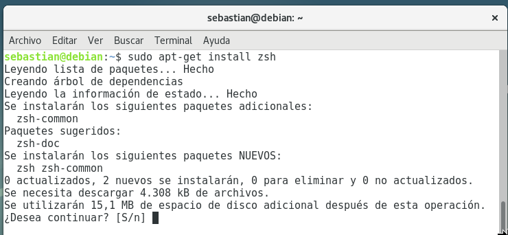 

Instalación plugin oh-my-zsh 
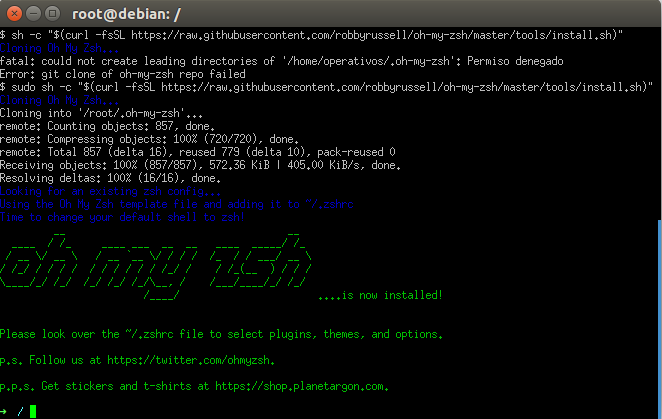 

Acceso mediante Token 
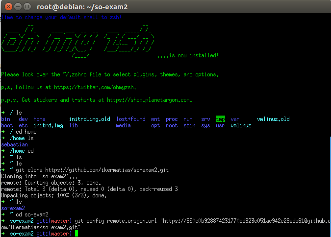 

comandos gaa, gscm, ggp 
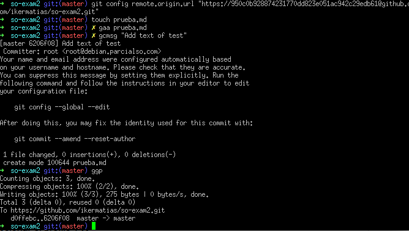 

**4 Punto** 
Primer comando con autosuggestion  
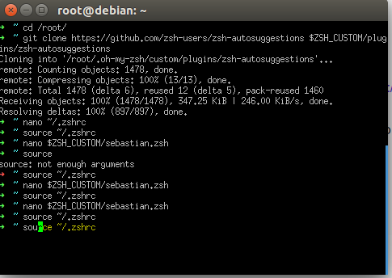 

Segundo comando con autosuggestion 
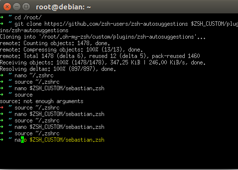

**5 Punto** 
Video Asciinema PD: Se adjunta imagen para corroborar mejorar el modo VI 

Imagen
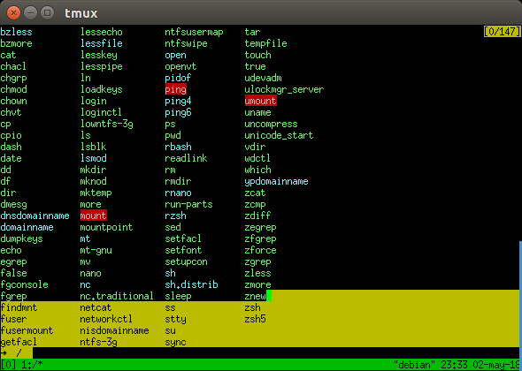 

**6 punto**
            Tmux 
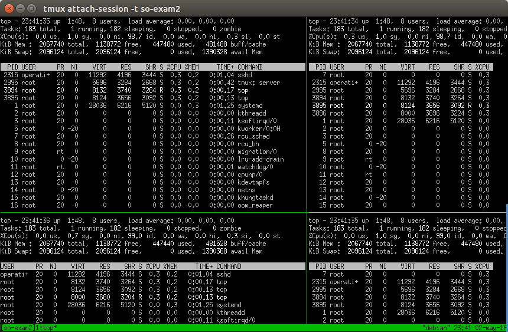 
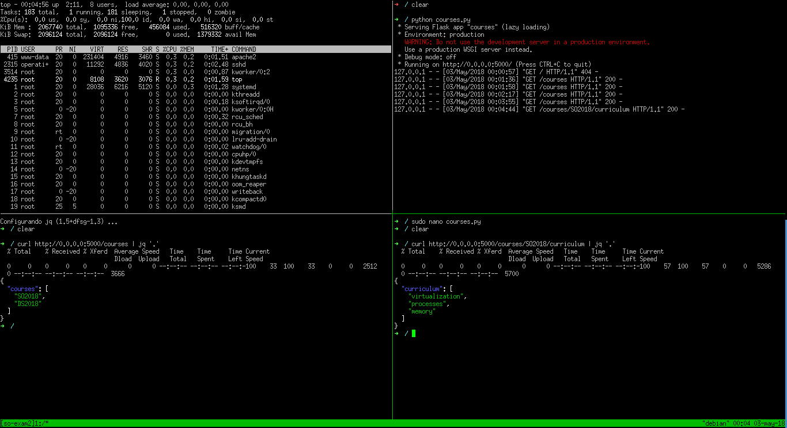 

**7 punto**
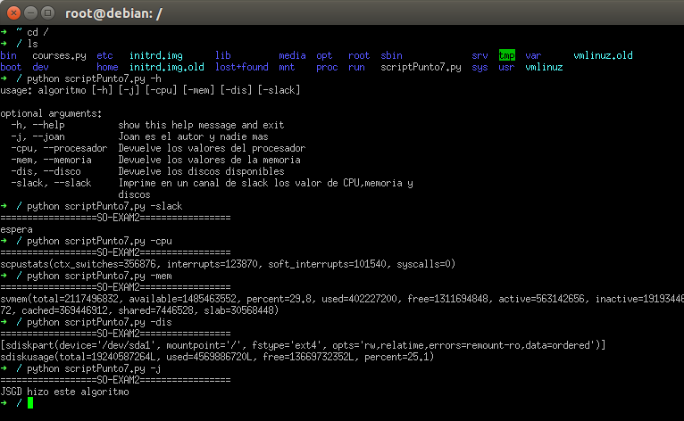 
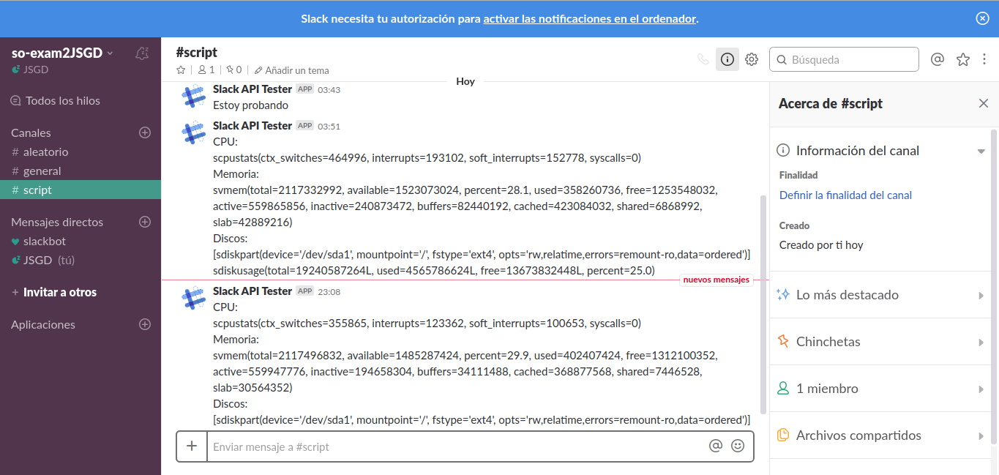 

El crontab se configuró de la siguiente manera (cada 10 minutos)
~~~
0,10,20,30,40,50 * * * * /usr/bin/python ./codigo_punto6.py -slack
~~~

            

